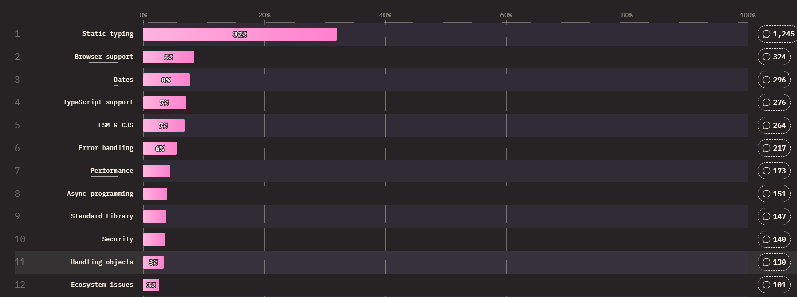

I've rather grandly titled this talk "The Future of TypeScript". I suppose we should start from the fundamentals:

---

I do believe `TypeScript` has a future. `TypeScript` has been going for eleven years now. It has worked its way into every corner of the web dev world.

By some metrics it's even more popular than `JavaScript`.

---

`TypeScript` used to say things like "we integrate with X" or "we have a config option for Y". It shipped experimental decorators for Angular, and JSX for React.

But now `TypeScript` is so popular that the formula has switched. Now bundlers, frameworks and libraries proudly announce that they integrate with `TypeScript`.

TypeScript is here to stay.

---

TypeScript solves a problem: the lack of native types in JavaScript.

In the latest State of JS survey, 32 percent of respondents said that they would love JavaScript to have static typing.

---

So I think we can confidently say types are good, and TypeScript is good at providing types.

---

The fact that TypeScript is so popular though comes at a strange cost. Timescript can't work in the browser. You've got to compile it down to javascript before it'll do anything.

So JavaScript now is more like a compile target than an actual language.

If you're writing TypeScript full time, you don't often open a JavaScript file. Maybe like once a week to change a config option, or to debug a problem. It's like having a weekly one-on-one with a boss you don't get on with.

---

And the fact that we're all writing TypeScript, and "thinking in TypeScript" puts the TypeScript team in a very powerful position.

If they wanted to, the TypeScript team could add any feature they wanted to TypeScript.

---

Imagine they suddenly got into their heads "Ah yes, functional programming is the best. Let's add the pipe operator to TypeScript."

There is a group of people probably in this audience that would bloody love that to happen. You'd write your pipe operators and TypeScript, and then it would compile down to JavaScript. It's the dream!

---

This idea sort of terrifies me. You would end up withjavascript on one side and then a fork of javascript on the other side - TypeScript. Typescript will get further and further away from javascript. And the further and further it gets away the more bundling and transpiling you have to do to get them to work together.

---

And for folks thinking "nah, they wouldn't do that", well, they already sort of did. With enums.

---

I get asked a lot why I don't like enums. They seem like a perfectly reasonable typescript feature. They're present in other languages. Why shouldn't typescript have enums?

---

Well enums don't exist in javascript. They are a typescript only feature.

---

- TypeScript is going from strength to strength
- The future of TypeScript is in the browser

- Why don't I like enums?
- Enums are a TypeScript-only, runtime feature
- They work well enough, but they have all sorts of strange issues. There are upwards of fifty unclosable issues on the TypeScript repo about enums

- TypeScript is a fork of JavaScript
- This causes all sorts of ramifications. You can't run TypeScript in the browser. You have to compile it down to JavaScript first.
- If we didn't have to do this, especially in development, this would be a massive time saver. Your dev server could just grab the TypeScript files and run them directly.
- When you're debugging typescript files, You need to generate source maps. Source maps let you create links from the line of code in the source file to the line of code in the compiled file. That lets you see exactly in your TypeScript code where your JavaScript code is erroring.

- So what's the future of this fork? Will it get forkier? Will TypeScript move further away from JavaScript?
- TypeScript is not getting any forkier - the TypeScript team is intimately involved with TC39, the committee that decides what goes into JavaScript
- Typescript only implements runtime features that reach Stage 3 in TC39. The recent addition of 'using' is a great example. Everyone thought it was a TypeScript feature. Nope, it's a JavaScript one.

- Many folks are adopting a style of TypeScript that Bloomberg calls "Modern TypeScript"
- This gets rid of enums, namespaces and parameter properties. You get to write JavaScript plus types. That's it.

- With "modern typescript", writing source maps is trivial. You remove the types, leave spaces where the types were, and you have your source maps.
- Bloomberg's project `ts-blank-space` (not Taylor Swift related) does this for you.
- TypeScript calls these features `erasable` - you can erase them and still have a working program.
- With enums, writing source maps is much trickier because the TypeScript code doesn't map directly to the JavaScript code. Enums, namespaces and parameter properties are not erasable.

- The Node.js team recently added the ability to run TypeScript code. And they chose to support erasable syntax only.
- "[By] supporting syntax that requires code generation we would lose the ability to replace with blank space and therefore not need sourcemaps."
- "Not to mention Node.js does not like codegen and magic behind the scenes so the goal was have a real experience of js + types."
- "Finally I believe by making this decision we push the ecosystem to standardize those features in the js language."

- This is a pretty massive deal. Node is probably the only JavaScript project that's bigger than TypeScript itself, except perhaps React.
- And how did the TypeScript team react? Did they kick up a fuss? Did they say "ugh, I wish they supported enums"?
- No. In TypeScript 5.8 there's a new flag coming: `erasableSyntaxOnly`. This will error if you use enums, namespaces or parameter properties.

- This tells you something. I think the TypeScript team sees the future of TypeScript as "Modern TypeScript". As using erasable syntax only.
- But there's a problem. The TypeScript team doesn't ship breaking changes. They can't just remove enums.
- So how do they make the leap to "Modern TypeScript"?
- The answer is a bit radical. It's to put the types in JavaScript.

- I know what you're thinking. "Runtime types in JavaScript? That'll never happen."
- And you're RIGHT. Runtime types, like they have in other strongly typed languages, will never happen in JavaScript.
- The central motto of TC39 is "don't break the web". Adding runtime types to JavaScript would break every site in existence.
- But what if they used a flag, or a directive? Like "use strict", but "use types"? That wouldn't break existing sites.
- Then, you get into the endless language design discussions. What should the syntax be? How many types should we add?
- Efforts to add types to JavaScript have been made before, and they've got stuck in endless discussions. It's too big a shift. It can't be done.
- The future of JavaScript is not with a runtime type system.

- But what if you had type annotations which were ignored by the JavaScript engine?
- That's kind of what "Modern TypeScript" is anyway - we're just using a bundler to strip them out early. What if we could ship them to Node (or the browser), and the engine could ignore them?
- There's a proposal to do just that. It's called "types as comments". It opens up syntactical spaces in the language to allow type annotations to be added, but treated as comments - just ignored.
- This means that you would write JavaScript files, but with the same type annotations you would use in TypeScript.

- Worth noting that you can sort of do this today using JSDoc comments.
- You can add `checkJS` to your TypeScript config, and it will check your JavaScript for type errors.
- But they're a bit clunky and not widely adopted. It's out of scope for this talk to describe why I don't like them, but let’s focus on the positives instead.

- There are some wrinkles with the types as comments proposal.
- Some small pieces of TypeScript syntax would need to change: type argument syntax -> turbofish syntax.

- But the types as comments proposal opens up a massive opportunity for the TypeScript team.
- It would allow them to get rid of enums and namespaces without breaking anyone's apps.
- Not only that, but it would de-fork TypeScript from JavaScript completely. There would be no need for source maps, since the source is being run at runtime.

- Why isn't types as comments in JavaScript yet?
- Quote from Gil Tayer: "It's dead in the water"
- I think this is where JavaScript and TypeScript are going.

- The current situation is fine. We could continue with a slightly forked TypeScript forever.
- We can continue bundling in development. We can continue generating source maps. We've gotten extremely good at it.
- In fact we're probably always going to do some bundling, especially for production. Serverless apps will always need fast cold starts, so minification is key. And browser apps will always be pushing down their bundle sizes, squashing their apps into smaller and smaller parcels.

- But so many folks are asking for static typing in JavaScript; the TC39 committee has to do something.
- "Modern TypeScript" is pretty good - especially now you can run it directly in Node.
- But "Modern JavaScript" would be even better. Defork it from TypeScript. Transform our local development experience. Make one unified language.

- And in this imaginary world, what is TypeScript's future?
- Well, as a kind of linter for JavaScript. It would be the tool that checks your types, and very little else.
- It would get smaller, more manageable, and more focused.

- So, to sum up, that's why I don't like enums.
- They're stopping TypeScript being used in the browser, which is where I think it belongs.
