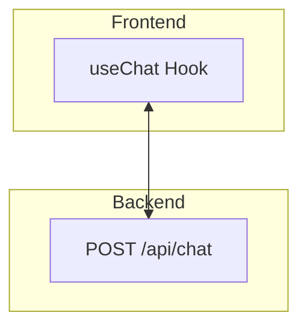

It's now time to hook up our model to the chat page. We're going to do that using the AI SDK.

Our plan is to create a POST route at `/api/chat` that will be used to send messages to the model.

In our frontend, we'll use the `useChat` hook from `@ai-sdk/react` to send messages to the model.



## Steps to Complete

- Make sure that the `ai` and `@ai-sdk/react` packages are installed.
- Add a POST route at `/api/chat` with the following contents:

```ts
import type { Message } from "ai";
import {
  streamText,
  createDataStreamResponse,
} from "ai";
import { model } from "~/models";

export const maxDuration = 60;

export async function POST(request: Request) {
  const body = (await request.json()) as {
    messages: Array<Message>;
  };

  return createDataStreamResponse({
    execute: async (dataStream) => {
      const { messages } = body;

      const result = streamText({
        model,
        messages,
      });

      result.mergeIntoDataStream(dataStream);
    },
    onError: (e) => {
      console.error(e);
      return "Oops, an error occured!";
    },
  });
}
```

- Add a `useChat` call to the existing chat page in the codebase with the following contents:

```ts
import { useChat } from "@ai-sdk/react";

// Inside our component
const {
  messages,
  input,
  handleInputChange,
  handleSubmit,
  isLoading,
} = useChat();
```

- Hook up the pre-built components to the properties returned from `useChat`:

  - `messages` is the full conversation history
  - `input` is the current value of the text input
  - `handleInputChange` is the function to call when the input changes
  - `handleSubmit` is the function to call when the input form is submitted
  - `isLoading` is a boolean that indicates if the model is loading

- Show a loading spinner when the model is loading. Plenty of icons from `lucide-react` will work.

## Not Required Yet

- There's no need to be able to persist the chats in the database.
- Every chat will be temporarily held in memory until the User closes the window.
- No need for any tool calls or searching - The model will simply use its pre-training to answer any questions.
- Do not add `stop` functionality to the chat page.
