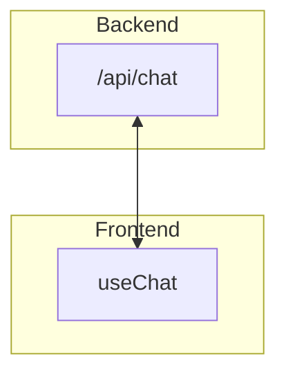

So we now have our loop, but it's not actually connected to the frontend.

We're going to get this working in a kind of hacky way first, then improve on it over the next few exercises.

## Streaming to the frontend

Our previous setup simply relied on a single `streamText` call, and passing that to the frontend. `useChat` then took care of showing the text and tool calls to the user.



This looked like this:

```ts
return createDataStreamResponse({
  execute: async (dataStream) => {
    // 1. Grab the result
    const result = streamFromDeepSearch({
      // ...options
    });

    // 2. Merge the result into the data stream
    result.mergeIntoDataStream(dataStream);
  },
});
```

This meant that the model did all of its thinking "out loud", in text that was presented directly to the user. Our new system does a lot of its thinking "internally" - in the choices it makes while running the loop.

The only time our new system resembles the old system is when it's answering the question via `answerQuestion` - then, it's streaming text that should be shown to the user as it's generated.

So, our new `streamFromDeepSearch` function should be changed so that it behaves like this:

```ts
return createDataStreamResponse({
  execute: async (dataStream) => {
    // 1. Wait for the result
    const result = await streamFromDeepSearch({
      // ...options
    });

    // 2. Once the result is ready, merge it into the data stream
    result.mergeIntoDataStream(dataStream);
  },
});
```

The `await` does a lot of work here - we wait for `runAgentLoop` to complete, and then we merge the result into the data stream.

That means that our user might be waiting a while for the first token to appear - but don't worry, we'll fix that soon.

## Fixing our existing functions

We can largely fix our existing functions by changing their return types.

`streamFromDeepSearch` and `runAgentLoop` should both return `Promise<StreamTextResult<{}, string>>`:

```ts
import type { StreamTextResult } from "ai";

export function streamFromDeepSearch(
  options: TheExistingOptions,
): Promise<StreamTextResult<{}, string>> {
  // ...
}

export function runAgentLoop(
  options: TheOtherExistingOptions,
): Promise<StreamTextResult<{}, string>> {
  // ...
}
```

In other words, they wait for the result to be ready, and then they merge it into the data stream.

`answerQuestion` should return `StreamTextResult<{}, string>`:

```ts
import type { StreamTextResult } from "ai";

export function answerQuestion(
  options: TheExistingOptions,
): StreamTextResult<{}, string> {
  // ...
}
```

This _doesn't_ return a promise, since it returns the result of a `streamText` call.

This should give your LLM enough guidance to integrate the new system.

## Steps To Complete

- Look for the existing `streamFromDeepSearch`, `runAgentLoop` and `answerQuestion` functions.

- Change their return types to match the new requirements.

- Ensure that `answerQuestion` is a `streamText` call.

- Delete the existing tool calls from `streamFromDeepSearch`.

- Fix any remaining type errors.

- Don't worry about the `onFinish` function passed into `streamFromDeepSearch`. We'll handle that when we tackle persistence.

- Run the app to see if it works - you should see a pause, and then the answer should appear.

- Also check that the evals are still working. Run `pnpm run evals` to check that them.
