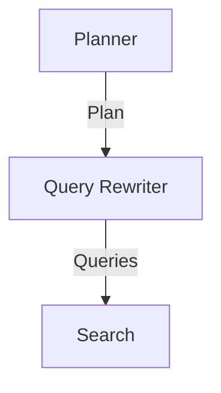

When we modularized our system, We did a good job of breaking out the 'answer' functionality from the 'choose next action' functionality.

However, the 'choose next action' function is still responsible for two very important, and distinct, tasks:

- Choosing which search queries to search for
- Choosing whether to search again, or to answer the question

These tasks are so different from each other that splitting them off makes sense - we can optimize them independently.

## Query Rewriting

Query rewriting is itself a highly specialised job, worthy of a course in itself.

For our purposes, we need to understand one thing: the queries represent the plan our system will take to answer the question.

This means that our query rewriting step is really a planning step. The queries are really the outputs of the plan.

There's even an argument to say we should do two LLM calls here. One to produce the plan, and another to take the plan and convert it into a set of queries:



However, we'll keep this approach on ice. Instead, we can ask the LLM to produce two outputs:

- A plan
- A set of queries

## Getting LLM's To Plan

What we're really doing here is forcing the LLM to use additional tokens on planning before it even starts to answer the question.

There are many techniques for getting LLMs to plan - one of the most popular is to use a 'chain of thought' prompting approach.

Here's an example prompt, adapted from [Together.ai's planning prompt](https://github.com/togethercomputer/open_deep_research/blob/66e43b47bfb8722ef9aad38139453922d1feef2a/src/prompts.yaml), that demonstrates this technique:

```
You are a strategic research planner with expertise in breaking down complex questions into logical search steps. Your primary role is to create a detailed research plan before generating any search queries.

First, analyze the question thoroughly:
- Break down the core components and key concepts
- Identify any implicit assumptions or context needed
- Consider what foundational knowledge might be required
- Think about potential information gaps that need filling

Then, develop a strategic research plan that:
- Outlines the logical progression of information needed
- Identifies dependencies between different pieces of information
- Considers multiple angles or perspectives that might be relevant
- Anticipates potential dead-ends or areas needing clarification

Finally, translate this plan into a numbered list of 3-5 sequential search queries that:

- Are specific and focused (avoid broad queries that return general information)
- Are written in natural language without Boolean operators (no AND/OR)
- Progress logically from foundational to specific information
- Build upon each other in a meaningful way

Remember that initial queries can be exploratory - they help establish baseline information or verify assumptions before proceeding to more targeted searches. Each query should serve a specific purpose in your overall research plan.
```

This prompt structure encourages the LLM to:

1. Analyze the question deeply before generating queries
2. Consider both explicit and implicit information needs
3. Create a logical progression of queries that build on each other
4. Start with broader context before narrowing down to specifics

## Adding our planner to the system

Our current system relies on the `getNextAction` function to rewrite the queries. We should re-tool that function to now only return one of two actions:

- `continue` - to indicate that we don't have enough information to answer the question yet
- `answer` - to indicate that we should answer the question

We'll then need to create a `queryRewriter` function that takes in our system context, and returns a list of queries.

These queries can then be fed into our existing searching setup - and they should be done in parallel for maximum speed.

## Beware our budgets!

We're now, by default, going to be making quite a few more queries. Our new setup encourages multiple queries at once.

This means, thanks to our new summarizer, we're going to be using quite a few more tokens.

So, we may need to tweak the number of search results we're asking for. 10 seems a little high - 3 seems low. Maybe 5-6 is a good starting point.

## What About The Frontend?

As it stands right now, our front end is pretty tightly coupled to the `getNextAction` function.

The `OurMessageAnnotation` type is used to communicate the action from the backend to the frontend - and the action is exactly what is returned from `getNextAction`.

```ts
import type { Action } from "./get-next-action";

export type OurMessageAnnotation = {
  type: "NEW_ACTION";
  action: Action;
};
```

We'll have a look at this later on - but for now, feed the updated action into the frontend and adjust the UI accordingly. Feel free to use placeholder text if needed.

## Steps To Complete

- Look for the `getNextAction` function in the codebase
- Look for where our loop is declared
- Update the `getNextAction` function to return either `continue` or `answer`, and remove any mention of search queries
- Create a `queryRewriter` function that takes in our system context, and returns a list of queries and a plan. Use structured outputs from the AI SDK, using `generateObject`.
- Update the loop to use the new `queryRewriter` function. REMEMBER that the `queryRewriter` should always run first, before the next action is taken.
- Update the frontend to handle the new message annotations coming from the backend.
- Run the system and see how it performs!
