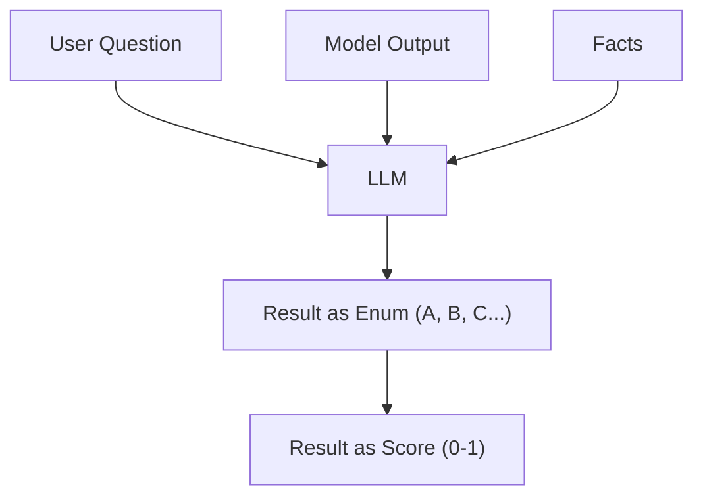
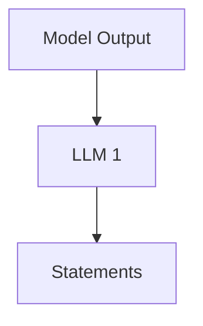
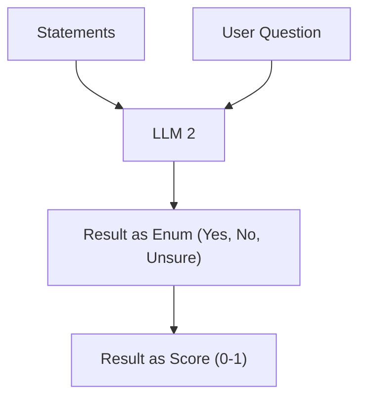

Let's add another eval to our list. We're going to try to assess how relevant the answer is to the question.

To do that, we're going to copy an example of an eval I found in the wild - in [Mastra's codebase](https://github.com/mastra-ai/mastra/blob/e2228f6925099e2e08dcbc0007e94d1930ff4f4e/packages/evals/src/metrics/llm/answer-relevancy/metricJudge.ts). [Mastra](https://mastra.ai/) is an open source TypeScript framework for building AI agents.

Its eval behaves in a pretty interesting way, with a slightly more complex setup than our previous Factuality eval.

## Our Previous Eval

Our previous factuality eval was designed in a super-simple way. It took the user's question, the model's output and some facts about the desired answer.

We then passed it into the LLM which returned an enum about how factual the answer was. We then converted that into a score (remember, LLM's aren't very good at picking numbers).



## The Mastra Eval

The Mastra eval does something slightly different. It first breaks down the model's answer into a list of statements.



It then passes the list of statements and the initial question into a second LLM, and scores as either `yes`, `no` or `unsure`.

Finally, we convert the enum into a score by scoring `yes` as `1`, `no` as `0` and `unsure` as `0.5`, and averaging them out.



This means we get a really good understanding of how relevant each part of the question is to the answer.

## Prompts

Here are the prompts used by Mastra's eval, copied from the [Mastra codebase](https://github.com/mastra-ai/mastra/blob/2d81790b9a9ec25b952ad3556ed5a92d03248751/packages/evals/src/metrics/llm/answer-relevancy/prompts.ts#L1).

### Statement Generation

First, the prompt for breaking down the model's answer into statements:

```ts
export function generateEvaluationStatementsPrompt({
  output,
}: {
  output: string;
}) {
  return `Given the text, break it down into meaningful statements while preserving context and relationships.
Don't split too aggressively.

Split compound statements particularly when they:
- Are joined by "and"
- Contain multiple distinct facts or claims
- Have multiple descriptive elements about the subject


Handle special cases:
- A single word answer should be treated as a complete statement
- Error messages should be treated as a single statement
- Empty strings should return an empty list
- When splitting text, keep related information together

Example:
Example text: Look! A bird! Birds are an interesting animal.

{{
    "statements": ["Look!", "A bird!", "Birds are interesting animals."]
}}

Please return only JSON format with "statements" array.
Return empty list for empty input.

Text:
${output}

JSON:
`;
}
```

### Relevancy Scoring Prompt

There are actually two prompts here - one a system prompt:

```ts
export const ANSWER_RELEVANCY_AGENT_INSTRUCTIONS = `You are a balanced and nuanced answer relevancy evaluator. Your job is to determine if LLM outputs are relevant to the input, including handling partially relevant or uncertain cases.

Key Principles:
1. Evaluate whether the output addresses what the input is asking for
2. Consider both direct answers and related context
3. Prioritize relevance to the input over correctness
4. Recognize that responses can be partially relevant
5. Empty inputs or error messages should always be marked as "no"
6. Responses that discuss the type of information being asked show partial relevance`;
```

And one to be passed to the `prompt` attribute of `generateObject`. This one is particularly detailed. Notice how many examples are provided.

```ts
export function generateEvaluatePrompt({
  input,
  statements,
}: {
  input: string;
  statements: string[];
}) {
  return `Evaluate each statement's relevance to the input question, considering direct answers, related context, and uncertain cases.

    Return JSON with array of verdict objects. Each verdict must include:
    - "verdict": "yes", "no", or "unsure"
    - "reason": Clear explanation of the verdict

    Verdict Guidelines:
    - "yes": Statement explicitly and directly answers the input question when it:
        * Contains specific answer to the question asked (e.g., "The color of the sky is blue")
        * States explicit relationship between key concepts (e.g., "X is the CEO of company Y")
        * Can stand alone as a complete answer
        * Contains appropriate question-type response (e.g., location for "where", person for "who")
        * Note: If statement is incorrect but directly addresses the question, mark as "unsure"

    - "unsure": Statement shows partial relevance when it:
        * Discusses the type of information being asked about (e.g., mentions temperatures when asked about temperature)
        * Contains information about the answer without explicit statement
        * Uses importance indicators ("main", "primary", "major") with relevant concepts
        * Includes indirect references to the answer (e.g., "where the president works")
        * Contains topic-related administrative/governance terms without direct answer
        * References functions or characteristics typically associated with the answer
        * Uses terms that match what's being asked about
        * Mentions related entities without specifying their relationship to the answer
        * Is incorrect but shows understanding of the question
        * Contains the answer term but needs more context to be complete
        * Contains measurement units or quantities relevant to the question type
        * References locations or entities in the same category as what's being asked about
        * Provides relevant information without using explicit question-type terminology
        * Contains references to properties of the subject that relate to the question type


    - "no": Statement lacks meaningful connection to question when it:
        * Contains neither the subject nor the type of information being requested
        * Contains no terms related to what's being asked about
        * Contains only general subject information without relating to what's being asked
        * Consists of empty or meaningless content
        * Contains purely tangential information with no mention of the subject or question type
        * Discusses the subject but not the specific attribute being asked about
        * Note: Assessment is about connection to what's being asked, not factual accuracy
        * Contains no connection to what's being asked about (neither the subject nor the type of information requested)

    REMEMBER: 
    - If the statement contains words or phrases that are relevant to the input, it is partially relevant.
    - If the statement is a direct answer to the input, it is relevant.
    - If the statement is completely unrelated to the input or contains nothing, it is not relevant.
    - DO NOT MAKE A JUDGEMENT ON THE CORRECTNESS OF THE STATEMENT, JUST THE RELEVANCY.

    STRICT RULES:
    - If a statement mentions the type of information being requested, it should be marked as "unsure" ONLY if it's discussing that type meaningfully (not just mentioning it)
    - Subject mentions alone are NOT enough for relevance - they must connect to what's being asked about
    - Empty or meaningless statements are always "no"
    - General facts about the subject without connection to the question type should be marked as "no"
    - ALWAYS mark a statement as "no" if it discusses the topic without any connection to the question type
    - Statements that mention neither the subject nor the type of information are always "no"
    - Type-level relevance overrides topic-only content
    - Measurement/quantity relevance counts as type-level relevance
    - Administrative/governance terms are only relevant if they relate to the question type
    - Descriptive facts about the subject should be marked as "no" unless they directly relate to the question type


    Examples of "no" statements:
        * "Japan has beautiful seasons" for "What is Japan's largest city?"
        * "Trees grow tall" for "How tall is Mount Everest?"
        * "The weather is nice" for "Who is the president?"

    Example:
    Input: "What color is the sky during daytime?"
    Statements: [
      "The sky is blue during daytime",
      "The sky is full of clouds", 
      "I had breakfast today",
      "Blue is a beautiful color",
      "Many birds fly in the sky",
      "",
      "The sky is purple during daytime",
      "Daytime is when the sun is up",
    ]
    JSON:
    {{
        "verdicts": [
            {{
                "verdict": "yes",
                "reason": "This statement explicitly answers what color the sky is during daytime"
            }},
            {{
                "verdict": "unsure",
                "reason": "This statement describes the sky but doesn't address its color"
            }},
            {{
                "verdict": "no",
                "reason": "This statement about breakfast is completely unrelated to the sky"
            }},
            {{
                "verdict": "unsure",
                "reason": "This statement about blue is related to color but doesn't address the sky"
            }},
            {{
                "verdict": "unsure",
                "reason": "This statement is about the sky but doesn't address its color"
            }},
            {{
                "verdict": "no",
                "reason": "This statement is empty"
            }},
            {{
                "verdict": "unsure",
                "reason": "This statement is incorrect but contains relevant information and still addresses the question"
            }},
            {{
                "verdict": "no",
                "reason": "This statement is about daytime but doesn't address the sky"
            }}
        ]
    }}

The number of verdicts MUST MATCH the number of statements exactly.

  Input:
  ${input}

  Number of statements: ${statements.length === 0 ? "1" : statements.length}

  Statements:
  ${statements}

  JSON:
  `;
}
```

## Steps To Complete

- Look for the existing implementation of the `Factuality` eval in our repo. Note the use of `generateObject` for returning structured outputs.
- Create an `AnswerRelevancy` eval in a separate file, using the structure described above, and the prompts from the Mastra codebase detailed above. Remember that evals must return a score between 0 and 1, and that the score will be derived by averaging the scores of the 'yes', 'no' and 'unsure' results.
- Find the existing evals, and add `AnswerRelevancy` to the list of evals.
- Try running the evals to check that it works.
