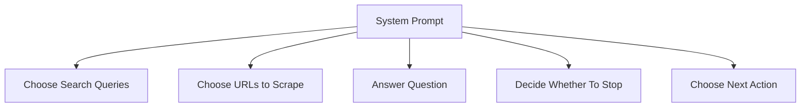
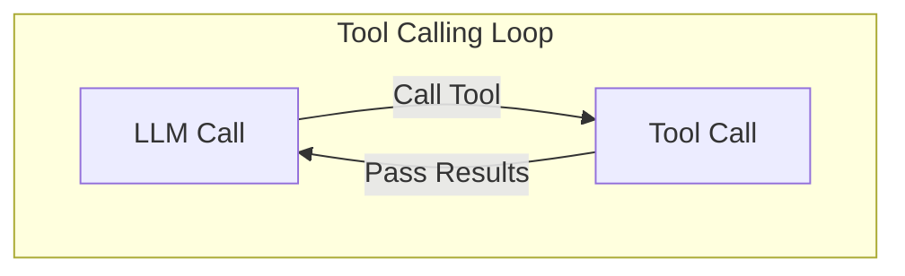
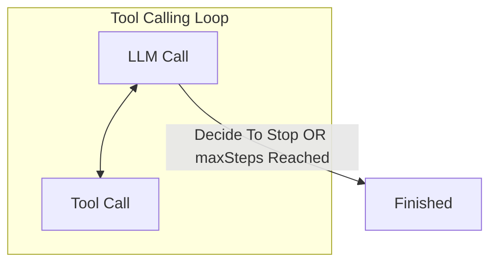

I've not been straight with you. We have some significant problems with our system.

It appears to work correctly, but it has one major flaw - all of the functions of our system depend on a single system prompt.



This means that our system is extremely sensitive to changes in the system prompt. If we want to improve the way our system searches the web, it might affect the way it answers questions.

This is a problem.

It also means we're tied in to using the same model, at the same temperature, for each action.

The way to improve our app is to make it more modular - to break each action out into its own model call.

However, it also means significant code changes.

### The `maxSteps` Loop

To make this work, we need to take control over a process that is currently managed by the AI SDK: the tool calling loop.

When we added `maxSteps` to our `streamText` call, we gave control of the loop to the AI SDK.



The LLM decides to call a tool, and then we pass the results back to the LLM.

It can stop this loop in one of two ways: either the LLM can decide to stop, or the `maxSteps` limit is reached.



Our plan is to take control of this loop.

### Our Loop

Let's pseudocode this so you can see what I mean. We'll start with a traditional `while` loop.

```ts
let steps = 0;
while (steps < 10) {
  steps++;
}
```

Inside here, we'll figure out which of several actions to take.

```ts
let step = 0;
while (step < 10) {
  const nextAction = await getNextAction();

  if (nextAction === "search") {
    await search();
  } else if (nextAction === "scrape-url") {
    await scrapeUrl();
  } else if (nextAction === "give-final-answer") {
    return answerQuestion();
  }
}
```

Each action will produce some output, which we'll need to pass as contecxt to the `getNextAction` function. So we'll save it in a container outside of the loop.

```ts
const ctx = {};

while (ctx.step < 10) {
  const nextAction = await getNextAction(ctx);

  if (nextAction === "search") {
    const result = await search(ctx);
    ctx.searchResults = result;
  } else if (nextAction === "scrape-url") {
    const result = await scrapeUrl(ctx);
    ctx.scrapedUrl = result;
  } else if (nextAction === "give-final-answer") {
    return answerQuestion(ctx);
  }
}
```

Similarly to the `maxSteps` loop, the LLM can decide to stop the loop - or we can stop it via a hard-coded limit.

If we reach the hard-coded limit, we should force the LLM to give a final answer:

```ts
const ctx = {};

while (ctx.step < 10) {
  // ...existing code...
}

return answerQuestion(ctx, {
  isFinalAnswerForced: true,
});
```

This means we always get a final answer - which in the current system is not guaranteed.

### What Benefits Do We Get?

We'll see the benefits of this slowly, as we add more to the implementation. But I'll give you a preview now:

- We can evaluate each action independently.
- We can choose the best model for each action.
- We can use a smarter stop condition, like a token budget or a time limit.
- We can customize the context passed to the `getNextAction` function, instead of relying on the shape of the chat history.
- We can use deterministic state machine logic to control which actions are taken.
- We can add parallelism to our system - which will be useful later.
