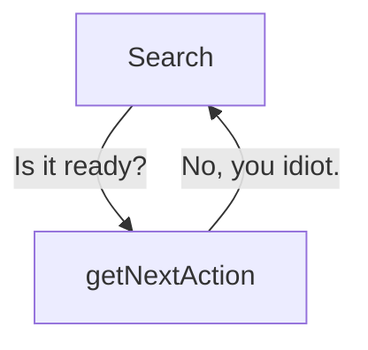
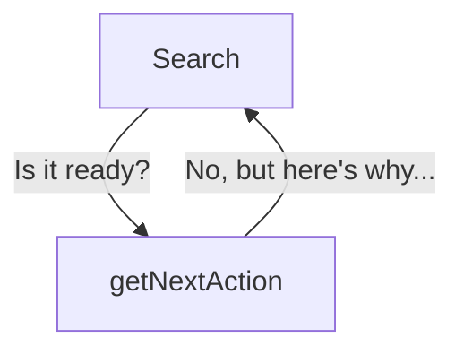

Our system over the last few exercises has actually changed a lot.

We have taken significant 'agency' away from the 'agent'. We now always search at the start of the loop.

Really what we've been calling our agent is actually simply an if-else statement.

- If we have enough information, we answer the question.
- If we don't have enough information, we search.

So this is feeling less to me like an agent, and more like an _evaluator_. The description of an evaluator-optimizer loop from Anthropic's [Building Effective Agents](https://www.anthropic.com/engineering/building-effective-agents) article feels apt:

> One LLM call generates a response while another provides evaluation and feedback in a loop.

So, let's embrace this design, and optimize around it.

## The problem with `getNextAction`

Our `getNextAction` function is acting a bit like an unhelpful colleague.

It takes in the information we have, and it returns a 'search' or 'answer' action.

It doesn't reply with anything else. It doesn't contribute potential solutions - it simply says 'yes' or 'no'.



I'm sure we've had clients, or even colleagues, like this. So let's not burden our system with them.

Instead, we should allow the `getNextAction` function to return more detailed feedback to the system.



## Making `getNextAction` more useful

The way to do this is:

- Get `getNextAction` to return feedback along with the next action
- Feed that feedback into our system context
- Use that feedback inside the query rewriter

### Changing the function

Making `getNextAction` return feedback is relatively simple - we just need to change the schema being generated.

I'd also recommend taking a look at the system prompt in `getNextAction` to make sure it's up to the job.

The system prompt from [Together.ai's DeepResearch evaluator](https://github.com/togethercomputer/open_deep_research/blob/66e43b47bfb8722ef9aad38139453922d1feef2a/src/prompts.yaml) is an interesting starting point. I've slightly modified it below:

```
You are a research query optimizer. Your task is to analyze search results against the original research goal and either decide to answer the question or to search for more information.

PROCESS:
1. Identify ALL information explicitly requested in the original research goal
2. Analyze what specific information has been successfully retrieved in the search results
3. Identify ALL information gaps between what was requested and what was found
4. For entity-specific gaps: Create targeted queries for each missing attribute of identified entities
5. For general knowledge gaps: Create focused queries to find the missing conceptual information
```

### Storing the feedback

We have two choices on how to store the feedback in the system context.

- Keep an entire history of all feedback given
- Keep only the most recent feedback

This is something you could experiment with and eval, but let's keep it simple and only store the most recent feedback.

## The Frontend

We need to adapt the frontend again. Now that `getNextAction` returns some feedback, we need to display that in the UI.

Use the same setup we used before - passing it down through message annotations and displaying it in the UI.

## Steps To Complete

- Look for the `getNextAction` function
- Look for where the loop is implemented
- Look for where the system context is stored
- Look for where we're passing message annotations to the frontend
- Update the `getNextAction` function to return feedback, and update its system prompt to be more focused on evaluation
- Update the system context to store the most recent feedback given by `getNextAction`
- Update the query rewriter to use the feedback given by `getNextAction`
- Update the frontend to display the feedback given by `getNextAction`
- Run the app and see what happens
