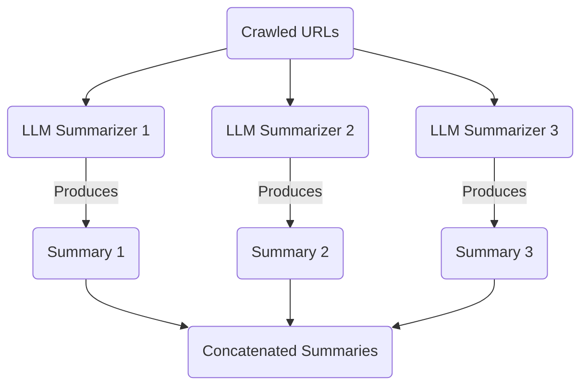
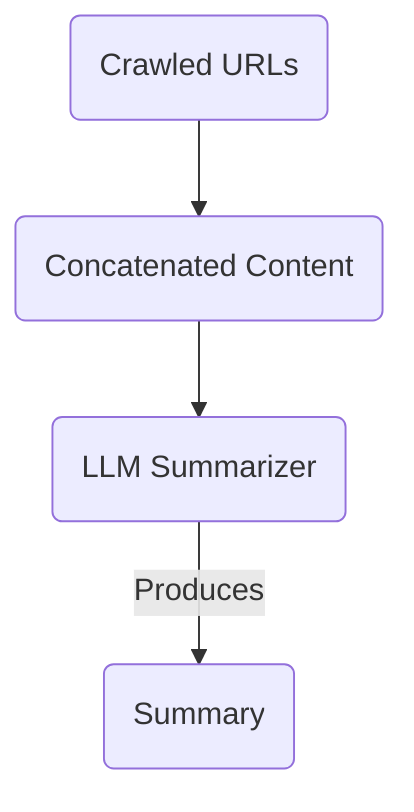

Now that we've picked our summarizer model, we need to implement it.

We have multiple options for our implementation, based on how much we want to feed into the summarizer:

### Option 1: One Summarizer Per URL

We are retrieving the contents of multiple URL's at once. The obvious approach is to pass each URL's content to a separate summarizer, and run them in parallel.



We'll end up with 3 separate summaries, which we can then concatenate together and pass as the result of the tool.

### Option 2: Passed To A Single Summarizer

Or, we can pass all the URLs to a single summarizer.



This will give us a single summary, instead of multiple.

This uses fewer LLM calls, which may end up being cheaper. We are also less likely to hit rate limits using this method.

However, the summaries we receive may be more biased to some of the URLs than others. And we may end up hitting the context window limits of the summarizer.

### Which Option Should We Use?

It's not clear which option will perform better. However, Option 2 seems easier to implement, and less likely to trigger rate limits.

## Supporting Information

### The Summarizer

The code for the summarizer should behave like this:

- It should take a list of URLs and their associated content.
- It should take in the query that triggered the search and crawl, to provide context for the summary.
- It should concatenate the content of the pages (and URLs) together.
- It should pass this concatenated content to a LLM (using `generateText` from `ai`)
- The system prompt should be tweaked to summarize the important information from the page.
- The output of the summarizer should be a string, representing the summary of the content.
- The summarizer should list all of the URLs that it used to create the summary.

### `generateText`

Remember that `generateText` does not return a string, but an extremely complex object. You will need to use the `text` property of the response.

```ts
import { generateText } from "ai";

const result = await generateText({
  // ...properties
});

return result.text;
```

## Steps To Complete

- To learn about the AI SDK (and `generateText`), look for existing examples in the codebase.
- Find the place where the tool for searching the web is implemented.
- The summarizer should use the `summarizerModel` that we've already created.
- Instead of just returning the results of the crawl, use a summarizer to summarize the content of the pages.
- IMPORTANT: The result of the tool call should be a single, nicely formatted string, not an array of objects. If the summarizer returns an array of objects, this will perform poorly at runtime. Your success greatly depends on returning a nicely formatted string from the tool call.
- Update the important-files file to include the new summarizer.
