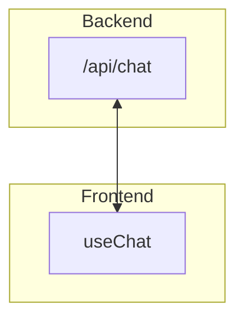

## Problem

We now have a working loop, but it's not streaming to the frontend.

When we gave up our dependence on the AI SDK for `maxSteps` loop, we also lost the nice streaming of the LLM's response.

However, there is a way around this. We can hijack the AI SDK's data protocol to stream a custom message to `useChat`.

Not only that, but we can output our own custom messages to the frontend.
