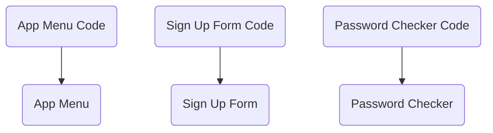
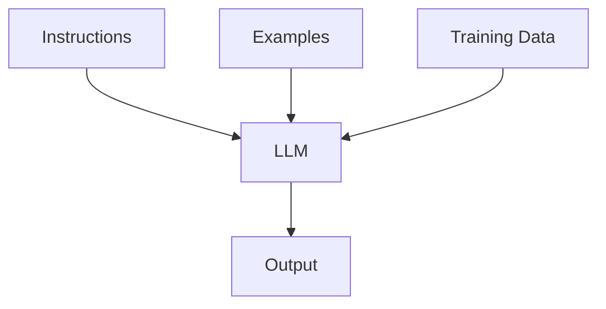
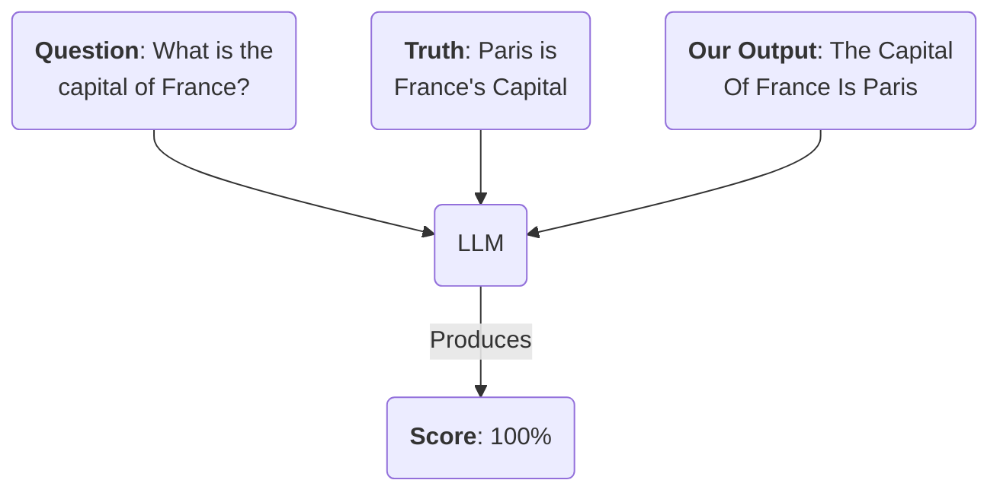

As we discussed in our [previous article](https://aihero.dev/the-ai-engineer-mindset), building with LLMs requires a fundamental shift in how you think about software development. You're no longer designing deterministic systems where inputs map to predictable outputs. Instead, you're working with probabilistic systems which are inherently unpredictable.

The key tool for managing this uncertainty is evals. Evals are the AI engineer's unit tests. They are how you wrangle predictability from a probabilistic system. They are an indispensable part of productionizing any AI app.

Let's break down what evals are, and why AI apps need them so badly.

## Why Traditional Testing Isn't Enough

Traditional software testing relies on deterministic relationships between inputs and outputs. Each component has a clear domain of responsibility:



But LLM-powered systems are different. Every input goes through a complex transformation process that's hard to predict:



In AI systems, no change is small. Their attention and transformation mechanisms are inscrutable. Whether the butterfly "flaps" or "Flaps" its wings may change the output. To put it mildly, building robust systems with them requires care.

## Manual QA Is Not Enough

It's easy to get an impressive AI demo working quickly. But getting that AI system to production is not easy.

Specifically, it's hard to know whether the things you're changing about your app are getting better or worse. You make a change, try a few favourite prompts and see if it "feels" better. But this is a dangerous way to work.

A "Manual QA-only" approach in deterministic software is usually doable. You say "I added a new page" and the QA team can rigorously test the new page, and smoke test the previous pages.

But in probabilistic systems, it is a killer. When any change can affect the entire system, you need a way to know if your system is getting better or worse.

This is especially true for large changes, like which model you use, or the design of your prompt.

## Evals

The key is automation. We need to evaluate our app every time we make a change, or every time the underlying model changes.

### Traditional, Deterministic Systems

In deterministic systems, automating testing is relatively straightforward. You can feed some inputs in and check the outputs.

```ts
const output = myNormalSystem(input);

// Will fail if the output doesn't match
assert(output === "my-desired-output");
```

These assertions are 'pass' or 'fail'. And usually, an app has to pass every test to be considered production-ready.

### Probabilistic Systems

But writing these tests for AI isn't as straightforward.

Let's say your app generates written articles. You want to check that the output is good enough for production. You might need to write assertions for:

- **Factuality**: checking if all statements in the output are factually correct
- **Writing style**: ensuring that the text is elegant and well-written
- **Prompt fidelity**: ensuring that the output actually corresponds to what the user asked.

These are qualitative metrics. Instead of a pass/fail, they need to be represented by a _score_. Each time you change your app, you need to know if it made the system 5% better, or 50% worse.

This is what evals do - they give you a score you can use to see how well your AI system is performing.

## Three Types Of Evals

There are three main types of evals you can run on your AI system.

### Deterministic Evals

There are **deterministic evals**, which can be written as simple assertions.

```ts
const article = writeArticleWithLLM(prompt);

// Article should be more than 300 words long
assert(article.length >= 300);

// Article should be less than 2,000 words long
assert(article.length <= 2000);
```

These are traditional pass/fail checks. You would pass a wide variety of prompts into your system, and check each time if they pass these tests.

They're simple to write, but only cover a subset of what you want to evaluate.

### Human Evaluation

For more probabilistic metrics, you have two choices.

You can use human evaluation to check whether your system is performing correctly. This is often your only choice early on, when you don't have a lot of data.

This is expensive, and time consuming - but all AI systems will rely on human input to some extent.

### LLM As A Judge

Another technique is to pass the results of your prompts into another LLM, and use that **LLM as a judge**. This is currently a very fashionable way to evaluate AI systems.

Let's imagine you may want to make sure your app is telling the truth. You can do that by passing your system's output into a LLM, along with some ground truth.



An example of this in action can be found on the [Evalite](https://www.evalite.dev/guides/scorers#creating-llm-as-a-judge-scorers) docs.

LLM-as-a-judge makes certain evaluations possible - but at a cost. Running LLMs are expensive, so you need to think carefully about what cadence you run them at. Running your evals every time your files change, for example, would be prohibitively expensive.

Common strategies include splitting your evals into two sets - a smaller group for local testing, and a larger group to be run daily.

## How Do I Improve My Evals Over Time?

Your evals are the method by which you monitor and improve your AI system. This also means that the dataset you use to evaluate your system is crucial.

You need to make sure that your evals are representative of the data your system will see in production. If you're building a classifier, you need to make sure your evals cover all the edge cases your system will see.

This means it's crucial to build in observability and feedback systems into your application. Once your app is deployed, your users will be the judge of whether your system is working or not. Simple feedback buttons, like upvotes and downvotes, can give you extremely valuable insights into how your system is performing.

### The Data Flywheel

Vercel, creators of [v0](https://v0.dev/), have written about the [AI Native Flywheel](https://vercel.com/blog/eval-driven-development-build-better-ai-faster#the-ai-native-flywheel). They describe the importance of evals in the AI development process.

The best data for your evals comes from your users. By carefully monitoring how users are using your app, you can build a feedback loop that will help you improve your system over time. Let's take an example:

- A **user asks** your app "build me a classy React application"
- **Your app** generates some React code. But instead of making the UI look "classy", it uses classes in the code.
- **The user downvotes** the response. Perhaps they even leave a comment explaining why.
- You take the prompt "build me a classy React application", and **create a new eval** for it. You add it to your eval suite.
- You **improve the system** until it passes the eval.
- You **re-deploy**. The next time a user hits this prompt, they get a better response.

This is the data flywheel in action. By carefully monitoring your system, and building in feedback loops, you can ensure your system is always improving.

## How Do I Run Evals?

There are many methods for running evals. A large number of startups have entered the space, offering tools to run your evals and view them online.

[Braintrust](https://braintrust.dev/) is a popular choice. They provide a cloud platform for running evals and sharing the results with your team, along with many other features. You can write your evals in TypeScript using their SDK. However, they use rate limits on your evals - which can be frustrating when you're trying to iterate quickly.

I maintain a library called [Evalite](https://www.evalite.dev/), which is a lightweight eval runner based on the TypeScript test runner [Vitest](https://vitest.dev).

Evalite is designed to allow you to run your evals locally. There's no cloud platform attached, so you can run your evals as often as you like. It's a good choice if you're just starting out.

## How Evals Work In Practice

Imagine an eval kind of like a function:

```ts
const score = runEval({
  // 1. The prompts we'll test with
  data: [
    "Fish species in the Mediterranean",
    "Story of the first Moon landing",
    "Are Krakens real?",
  ],
  // 2. A function to generate outputs based
  // on our prompts
  task: async (topic) => {
    return generateArticle(topic);
  },
  // 3. The scorers we'll use to generate
  // the final score
  scorers: [
    // Checks if output is long enough
    length,
    // Uses an LLM to check if it's accurate
    factualAccuracy,
    // Uses an LLM to check writing style
    writingStyle,
  ],
});

// 4. A score between 0-100%
console.log(score);
```

We pass in a set of prompts (1), then the task to run (2), then the methods we're using to score our output (3).

Finally, we get back a score on how well our function performed (4).

This, at its heart, is what an eval is. This API is loosely inspired by Braintrust's [autoevals library](https://github.com/braintrustdata/autoevals).

## It's The Evals, Stupid

This image, based on Vercel's AI Native Flywheel, captures the impact evals have on your application.

<ThemeImage urls={{dark: "https://res.cloudinary.com/total-typescript/image/upload/v1742902084/aihero.dev/ai-roadmap/what-are-llms-useful-for/dark/It_s_The_Evals_Stupid_otd3h5.svg", light: "https://res.cloudinary.com/total-typescript/image/upload/v1742902000/aihero.dev/ai-roadmap/what-are-llms-useful-for/light/It_s_The_Evals_Stupid_vukpmx.svg"}} width={808} height={545} alt="Circular flowchart titled 'It's The Evals, Stupid' showing how evals connect system design, models, product, distribution, usage, and data in a feedback loop. Arrows link stages: New Prompting/System Design Techniques → Evals → Product → Distribution → Usage → Data → back to Evals. A New Model Appears also connects into Evals." />

They should be the center of your feedback loop. As more users use your app (distribution), they'll give you more data (usage). You can use this data to improve your app (data), and then run your evals again (evals).

These evals let you respond to new techniques and models, and put you on a constant path of improvement.
