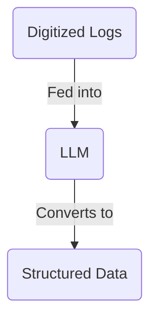
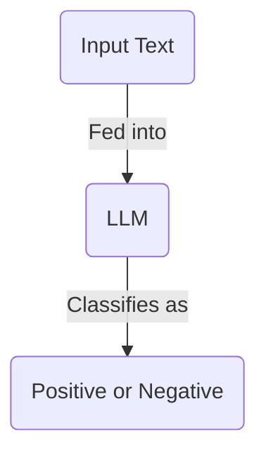
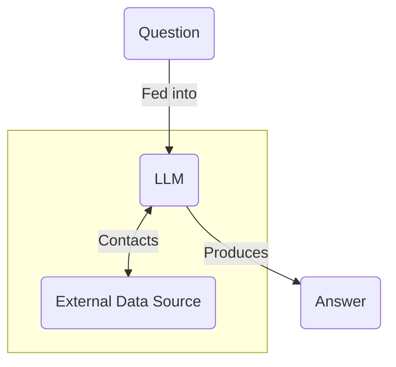
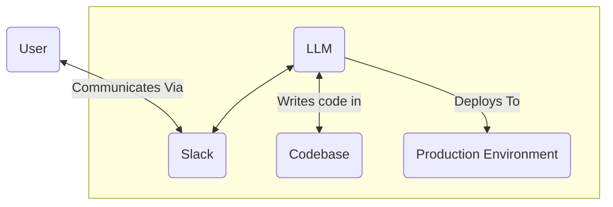

Before we dive into the world of LLMs, and how they work, we first need to know where we're going.

What are LLMs actually used for these days? What utility do they have? What can you build with them?

In this article, we'll explore the different applications of LLMs. We'll also look at things you shouldn't build with LLMs - things that are better suited to more deterministic tools.

## Use LLMs For...

### Unstructured Data -> Structured Data

Most companies have access to a lot of unstructured data. These could be transcripts from support calls, customer emails, invoices, or even just notes from meetings.

This data is hard to work with. It's hard to search, hard to analyze, and hard to read.

For example, a friend of mine has started a PhD looking at historical hawk migration patterns. Data for how these hawks moved is recorded in ancient, unstructured logs from the 19th century. Despite being carefully archived and digitized, reading through these logs is an absurdly time-consuming task.

The solution? To use LLMs to convert these logs into tabular data. LLMs can read the logs, understand the patterns, and convert them into a structured format. This structured format can then be used for analysis, visualization, and further research.

This is perhaps the most common, powerful use case for LLMs. The world has collected vast amounts of data in the past few decades. LLMs are now making that data trawlable and accessible.

This is a common theme—LLMs are often used for data tasks that it would be impractical (or expensive) to hire humans for. This opens up new possibilities for working with previously inaccessible data.

### Labeling & Classification

Another common task for LLMs is classification. They can be fed an input and asked to attach labels to it, which helps in organizing and understanding the data more effectively.

One striking example comes from [The Prompt Report](https://www.aihero.dev/the-prompt-report). In their case study, they attempt to detect "signal that is predictive of crisis-level suicide risk in text written by a potentially suicidal individual". They used data from the subreddit [r/SuicideWatch](https://www.reddit.com/r/SuicideWatch/), and the LLM had to match up with an expert's analysis.

The LLM, when provided with the text, would have to classify whether or not it contained elements of either "frantic hopelessness" or "entrapment". It would reply with "positive" (i.e., that the text contained risk signals) or "negative".

Classification systems have been around in machine learning for a long time. They usually require significant amounts of data to train. LLMs make this process easier by only requiring a simple prompt to change their behavior to a classifier. Very useful.

Recent developments in LLMs also mean it's easier to retrieve structured data from them. Check out a [classification example](https://www.aihero.dev/generate-enums-with-vercel-ai-sdk?list=vercel-ai-sdk-tutorial) from the Vercel AI SDK tutorial.

### Question Answering

Another common use case for LLMs is as a question answerer. You can feed an LLM a question, and it will give you a response based on its training data.

However, LLMs have several downsides when used as a knowledge base. Their training data has a cut-off point, so it doesn't have access to up-to-date information. They often can't cite sources for their answers, which makes it hard to verify their accuracy.

Therefore, connecting LLMs to external data sources is a common pattern.

This external data source could be a database, a search engine, or any API. LLMs can call external services (using [tools](https://www.aihero.dev/tool-calls-with-vercel-ai-sdk)) to get the most up-to-date information.

This is not foolproof—careful work is needed to make sure the LLM does not hallucinate or provide incorrect information. But question answerers, in the form of chatbots or search engines, are a common use case for LLMs.

DeepResearch, a now-common offering from Perplexity, Google, OpenAI, and others, is a good example of this. It's a pattern where an entire academic-style report is generated from a simple query.

### Agents

The fact that LLMs can access external tools has a lot of folks very excited. It means that LLMs can be used to _do things_ in the world, not just generate text.

This pattern is often called an "agent"—a system that can take actions in the world, respond to user inputs, and interact with other systems.

One can imagine a coding agent acting like a team member—contactable via Slack, able to write code, deploy it to production, and communicate with the user.

This is similar to the promise of agents like [Devin](https://devin.ai/).

However, agents have not yet had their breakout moment—certainly not in the way chatbots have. Agents are yet to find their final form in terms of user experience.

## Don't Use LLMs For...

### Naive Chatbots

It can feel very tempting to build chatbots with LLMs. It's very simple to set up. You feed the LLM a prompt, give it access to a conversation history, and you're good to go.

"Chat with our docs." "Chat with our support bot." "Chat with your search results." Naive chatbots are thin wrappers around LLMs, hastily thrown together to make a product seem more interactive.

However, productionizing chatbots is an extremely difficult problem. If you're not careful, they will frustrate your users and damage your brand. It is notoriously difficult to make a chatbot only respond to relevant queries without veering off-topic.

The big model providers (OpenAI, Anthropic, Google, etc.) come with built-in guardrails to prevent their models from saying anything brand-damaging. But the surface area is so large—any potential conversation you can think of—that these guardrails will likely never be perfect. A famous example is Google's Gemini asking the user to die.

It only takes one determined user to jailbreak your chatbot and make it say something inappropriate. Don't ship chatbots without proper safeguards.

### Deterministic Systems

A good rule of thumb for AI systems is "if it can be built deterministically, it should be."

LLMs are probabilistic systems. They are designed to choose the next word in a piece of text, over and over again, from a choice of many possible options. Depending on how the next word is selected (their "sampling strategy"), they can produce different outputs from the same input.

However, this design also makes them prone to several failure modes:

- Hallucinations: generating text that is not grounded in reality
- Sycophancy: overly conforming to the user's point of view, instead of providing a balanced response

These failure modes can be worked around, but they require careful design and testing. This means that if you can build a system deterministically, you should.

Deterministic systems are far easier to test, debug, and maintain. They are safer to put into production and are often faster and cheaper to run.

## Conclusion

Deterministic systems are not going away. They are infinitely easier than AI apps to build, test, and maintain. In a world where folks are throwing LLMs at every problem, being able to sniff out _when not to use them_ is a valuable skill.

**Deterministic systems should be your default choice for any task**, until you hit a barrier which can only be solved by an LLM.

But LLMs do have their place. Let's take the LLM use cases we've seen so far and put them into two buckets.

First, there are the tasks that are **too expensive to hire humans for**:

- Converting unstructured data into structured data
- Labeling and classification

Then, there are the tasks that are **too complex for deterministic systems**:

- Question answering
- Text generation
- Agents

So any task that falls into one of these buckets is a good candidate for an LLM.
