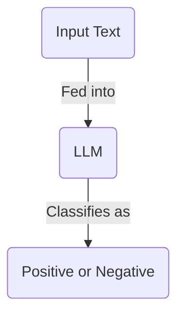

Before we dive into the world of LLM's, and how they work, we first need to know where we're going.

What are LLM's actually used for these days? What utility do they have? What can you build with them?

In this article, We'll explore the different applications of LLMs. We'll also look at things you shouldn't build with LLM's - things that are better suited to more deterministic tools.

## What To Build

### Unstructured Data -> Structured Data

Most companies have access to a lot of unstructured data. These could be transcripts from support calls, customer emails, invoices, or even just notes from meetings.

This data is hard to work with. It's hard to search, hard to analyze, and hard to read.

For example, a friend of mine has started a PhD looking at historical hawk migration patterns. Data for how these hawks moved is recorded in ancient, unstructured logs from the 19th century. Despite being carefully archived and digitised, reading through these logs is an absurdly time-consuming task.

The solution? To use LLM's to convert these logs into tabular data. LLM's can read the logs, understand the patterns, and convert them into a structured format. This structured format can then be used for analysis, visualization, and further research.

This is perhaps the most common, powerful use case for LLM's. The world has collected vast amounts of data in the past few decades. LLM's are now making that data trawlable and accessible.

This is a common theme - LLM's are often used for data tasks that it would be impractical (or expensive) to hire humans for. This opens up new possibilities for working with previously inaccessible data.

### Labeling & Classification

Another common task for LLM's is classification. They can be fed an input, and asked to attach labels to it, which helps in organizing and understanding the data more effectively.

One striking example comes from [The Prompt Report](https://www.aihero.dev/the-prompt-report). In their case study, they attempt to detect "signal that is predictive of crisis-level suicide risk in text written by a potentially suicidal individual". They used data from the subreddit [r/SuicideWatch](https://www.reddit.com/r/SuicideWatch/), and the LLM had to match up with an expert's analysis.

The LLM, when provided with the text, would have to classify whether or not it contained elements of either "frantic hopelessness" or "entrapment". It would reply with "positive" (i.e. that the text contained risk signals) or "negative".

Classification systems have been around in machine learning for a long time. They usually require significant amounts of data to train. LLM's make this process easier by only requiring a simple prompt to change its behaviour to a classifier. Very useful.

Recent developments in LLM's also mean it's easier to retrieve structured data from them. Check out a [classification example](https://www.aihero.dev/generate-enums-with-vercel-ai-sdk?list=vercel-ai-sdk-tutorial) from the Vercel AI SDK tutorial.

### Question Answering

### Code Generation

### Agents

## What Not To Build

### Naive Chatbots

### Deterministic Systems

A good rule of thumb for AI systems is "if it can be built deterministically, it should be".
