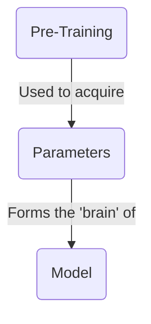
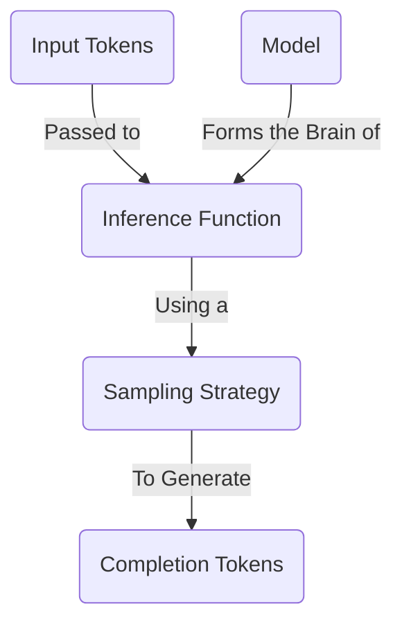
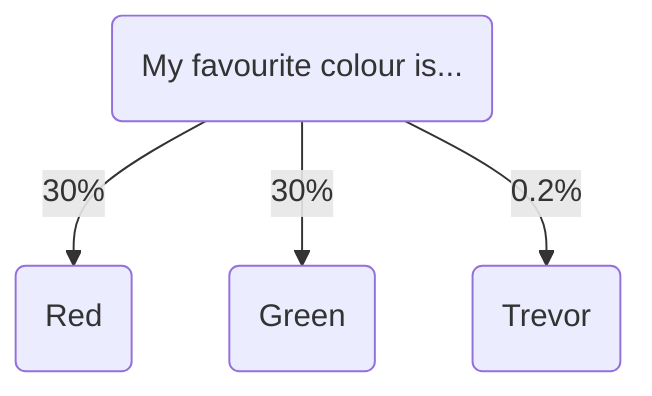
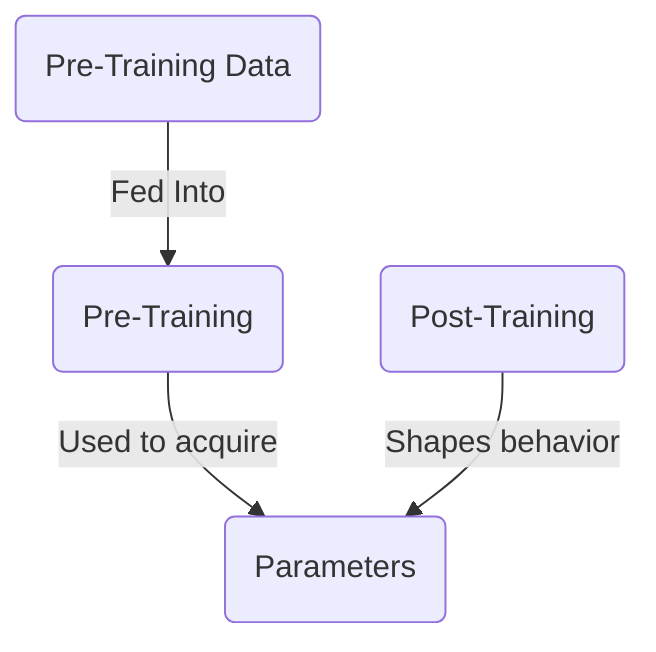

In this article, we'll cover the basics of large language models. We'll talk about what they are, how they work, and touch on the process of creating them.

Most of the resources out there go really deep into how LLMs work - we're not going to do that. Instead, I'll give you a brief overview of the most common concepts so you can go ahead and get building.

## What Is A Large Language Model?



A large language **model** is essentially a massive compressed file - think of it like a 1TB zip file. This file contains a bunch of numbers, encoded as 16-bit floats. These numbers are the **parameters** of the model.

```txt
0.1239784871238176123 // Parameter 1
0.1515689756890123123 // Parameter 2
```

These parameters represent the 'brain' of the model. They are the result of the model's **pre-training**: a process that takes a huge amount of text data and 'compresses' it into these numbers. They represent the model's understanding of the world, and give it the ability to remember facts and make decisions.

The number of these parameters represents the size of the model's brain. In general, models with larger brains perform better, but run slower. A model with **70B parameters will run ~10x slower than a model with 7B parameters**.

Already, we're looking at a size vs speed tradeoff - a common theme when choosing large language models.

## How Do You Run A Large Language Model?



In order to get the model to do anything useful, you need to perform **inference** on the model.

Inference is the process of sending text to the model and getting a response back. This is done using an **inference function** - a piece of software that takes the parameters of the model and runs an algorithm on them to find the next word. This is far cheaper than pre-training the model, and can be done on your laptop.

For a deep-dive into how inference works, check out [this incredible interactive walkthrough](https://bbycroft.net/llm).

### Sampling Strategy

To find the next word, the model looks at all the possible tokens it could choose, and picks one.



To do so, it uses a **sampling strategy** picked by the developer. This strategy determines how the model chooses the next word. The most common strategies are:

- **Greedy Sampling**: The model always picks the most likely word.
- **Top-K Sampling**: The model picks from the top K most likely words.
- **Top-P Sampling**: The model picks from the words that make up P% of the probability mass.
- **Temperature Sampling**: The model introduces randomness into the selection process, allowing for more diverse outputs.

It's beyond the scope of this article to go into the details of these strategies. Usually, as an AI Engineer, you don't have the ability to change the sampling strategy of the model you're using. However, you can tweak variables, like the temperature, to get different results.

## What Are Input Tokens?


When you send text to the model, it first needs to be **tokenized**. This is the process of breaking the text up into individual words, and then converting those words into numbers. These numbers are the input tokens, which are passed to the inference engine.

Each model has its own tokenizer. [Tiktokenizer](https://tiktokenizer.vercel.app/) is a great playground for exploring different tokenizers.

## How Do You Create A Model?



In order to acquire the parameters, you need to train the model. Training large language models is an extremely involved process that requires a lot of time, expertise, and money. Learning how to do it is outside the scope of this article.

A rough guide is to take a chunk of the internet, let's say 10TB of data. You use 6,000 GPU's for 12 days, at the cost of around $2M. And you end up with a ~140GB file with all the parameters of the model.


The training process has two main phases:

1. **Pre-training**: This gives the model its knowledge by compressing vast amounts of internet data into parameters
2. **Post-training**: This shapes the model's personality and behavior through careful instruction and example.

You end up with a huge file of parameters - a kind of 'compressed' version of all of the data the model was trained on, with its personality shaped by post-training. Without post-training, the model would just be an inert blob of knowledge - it wouldn't know how to behave like a helpful assistant.

#### Resources

- [Intro To Large Language Models](https://www.youtube.com/watch?v=zjkBMFhNj_g) by Andrej Karpathy
- [How I Use LLM's](https://www.youtube.com/watch?v=EWvNQjAaOHw) by Andrej Karpathy

## How Do You Introspect A Model?


It's possible (though very difficult) to dive into the parameters of a model to work out which ones correspond to which real-world concepts. For instance, Anthropic found that models can:

- Share concepts across languages, suggesting a kind of universal "language of thought"
- Plan ahead when writing (like planning rhymes in poetry)
- Use multiple parallel pathways for tasks (like mental math)
- Sometimes fabricate plausible-sounding reasoning rather than showing their true thought process

By understanding how models think, we can better anticipate their behavior and potentially remove some of the "magic" that makes them hard to trust. This could lead to more controlled, deterministic AI systems in the future - but the research is still in its early stages.

#### Resources

- [Tracing the thoughts of a large language model](https://www.anthropic.com/research/tracing-thoughts-language-model) by Anthropic
- [Golden Gate Claude](https://www.anthropic.com/news/golden-gate-claude) by Anthropic

## Conclusion

Large language models compress vast amounts of knowledge into numerical parameters. While they're built on complex math, you don't need to understand their inner workings to use them effectively. Getting a basic lay of the land is enough to build smart intuitions about how they work.

In the next article, we'll explore how to choose the right LLM for your specific needs.
