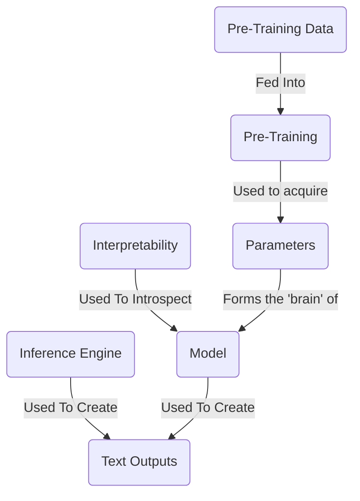
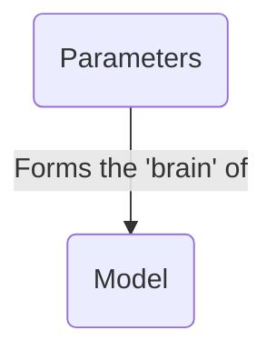
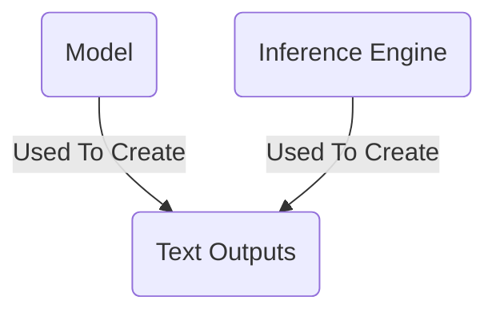
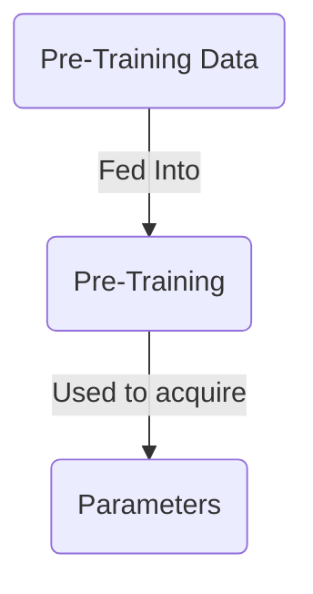
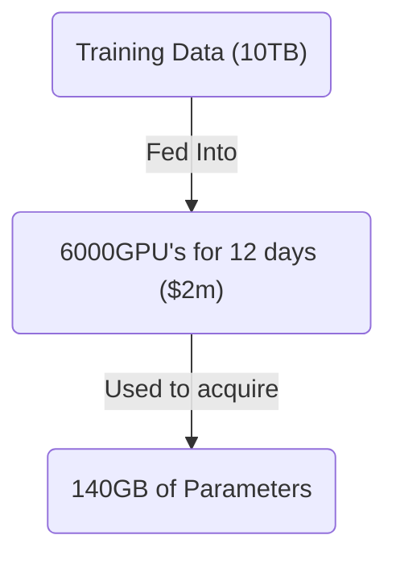
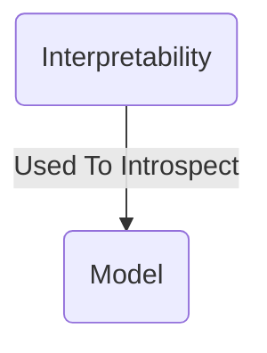

The topic of what a large language model is has been discussed to death. There are a tonne of really great resources out there.

I'm going to take some of those resources and provide a summary for you.



## What Is A Large Language Model?



A large language model is a single massive file. This file contains a bunch of numbers, encoded as 16-bit floats. These numbers are the _parameters_ of the model.

```txt
0.123978487123876123
0.1515689756890123123
```

These numbers represent the 'brain' of the model. They are the result of the model's pre-training: a process that takes a huge amount of text data and 'compresses' it (to use Andrej Karpathy's analogy) into these numbers.

The number of these parameters represents the size of the model's brain. In general, models with larger brains perform better, but run slower. A model with 70B parameters will run ~10x slower than a model with 7B parameters.

## How Do You Run A Large Language Model?



In order to get the model to do anything useful, you need to perform _inference_ on the model.

Inference is the process of sending text to the model and getting a response back. This is done using an _inference engine_ - a piece of software that takes the parameters of the model and runs them on your text. This is far cheaper than pre-training the model, and can be done on your laptop.

Explaining how this works is outside the scope of this article. But in general, you send text to the model, and it returns text back to you. Startups like [Groq](https://groq.com/) promise fast inference on existing models.

## How Do You Create A Model?



In order to acquire the parameters, you need to train the model. Training large language models is an extremely involved process that requires a lot of time, expertise, and money. Learning how to do it is outside the scope of this article.

A rough guide is to take a chunk of the internet, let's say 10TB of data. You use 6,000 GPU's for 12 days, at the cost of around $2M. And you end up with a ~140GB file with all the parameters of the model.



You end up with a huge file of parameters - a kind of 'compressed' version of all of the data the model was trained on.

## How Do You Introspect A Model?



It's possible (though very difficult) to dive into the parameters of a model to work out which ones correspond to which real-world concepts. For instance, Anthropic found the parameters in their model which correspond to the ["Golden Gate Bridge"](https://www.anthropic.com/news/golden-gate-claude). For 24 hours, they released a version of Claude which only talked about the Golden Gate Bridge.
