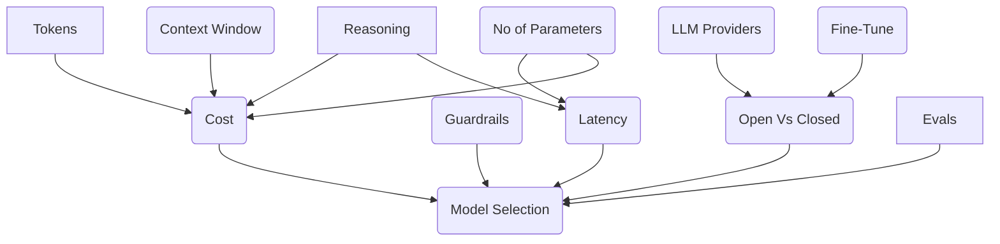
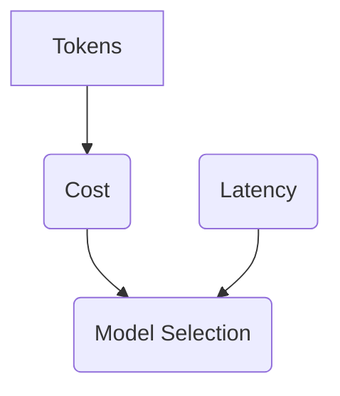

## How To Choose A LLM

Choosing the right model is crucial to the success of your AI-powered app. It's a tough, many-layered decision that you don't only make once - you'll have to make it over and over again as new models emerge and your app evolves.

### Cost And Latency

Let's start by assessing the two main factors that go into choosing a model. They are cost and latency. In other words:

- Cost: How much will I be spending?
- Latency: How quickly will I get results back?

Cost is relatively simple to forecast. Most LLM providers charge by token.

---

"During the application development process, as you progress through different adaptation techniques, you'll have to do model selection over and over again. Prompt engineering might start with the strongest model overall and then work backward to see if smaller models would work." - Chip Huyen

"Choosing a model is basically a 4-step process:

1. Figure out the models whose hard attributes don't work for you. This depends on your commercial policies, whether you want to use commercial APIs or host your own models.

2. Use publicly available information like benchmark performance leaderboard rankings. This will help you narrow down the most promising models to experiment with. At this point, you're balancing different objectives such as model quality, latency, and cost.

3. Run experiments with your own evaluation pipeline to find the best model balancing all your objectives.

4. Continually monitor your model in production to detect failures and collect feedback." - Chip Huyen

## Open Source Vs Closed Source Models

"There's a difference in terms between "open weight" versus "open model". Open weight refers to models that don't come with open data, whereas open model is used for models that do come with open data." - Chip Huyen

## Leaderboards And Benchmarks

The Open LLM leaderboard is a great place to look at the leaderboard for open LLMs.

It measures against various benchmarks and is a great place to see how open AI models stack up against each other.

You can access it here: https://huggingface.co/spaces/open-llm-leaderboard/open_llm_leaderboard#/

## Guardrails

"These guardrails are good for the vast majority of use cases but can be a limiting factor for certain ones. For instance, if your application requires generating real faces, a model that refuses to generate real faces won't work." - Chip Huyen

## Context Window Size

Exploring context window size is crucial as it affects how much information the model can utilize from the input when generating its outputs.

### What Is A Context Window?

The context window is the number of tokens the model can see at a time. The larger the context window, the more information the model can use to generate its outputs.

Models like Gemini have extremely large context windows, allowing them to receive more information from the input.

## Latency Matters

Need to consider different types of latency for foundation models:

- Time to first token
- Time per token
- Time per query
- Time between tokens, etc.

Understand what latency metrics matter to you.
