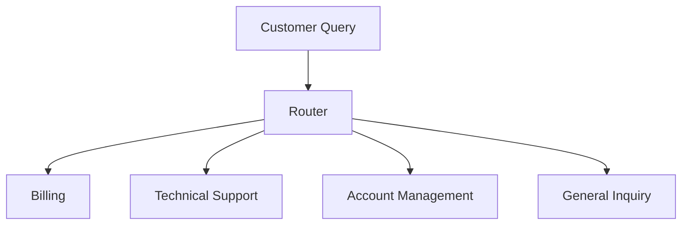

Once you clearly understand your success criteria, have picked your model, and written some basic evals, it's time to start improving your system.

The process of improving your system comes down to two things:

- Improving your **feedback loop** (evals)
- Improving the **performance** of the system itself

We've already looked at how to improve your evals. In this article, I'll give you an overview of the main ways you can improve your system.

But first, let's talk about the mindset you need to have when improving your system.

## Try the Simple Thing First

We've already seen that improving an AI system is an [experimental process](/the-mindset-of-an-ai-engineer). You need to try things out, see what works, and iterate.

Techniques for improving a system range from simple and cheap to complex and expensive. Tweaking a prompt? Cheap. Training a model from scratch? Astonishingly expensive.

I call this the Staircase Of Complexity Hell:

<ThemeImage urls={{dark: "https://res.cloudinary.com/total-typescript/image/upload/v1742913151/aihero.dev/ai-roadmap/what-are-llms-useful-for/dark/The_Staircase_To_Optimization_Hell_wyqa9o.svg", light: "https://res.cloudinary.com/total-typescript/image/upload/v1742913291/aihero.dev/ai-roadmap/what-are-llms-useful-for/light/The_Staircase_To_Optimization_Hell_miqhxk.svg"}} width={738} height={427} alt="Diagram titled 'The Staircase to Optimization Hell' showing a descending staircase with increasing complexity and cost. Steps from top to bottom: Zero-Shot, Few-Shot, Chain of Thought, Temperature, Workflows, Evaluators, Agentic Loops, LLM Routers, Fine-Tuning, Sampling. Gradient background from teal to red indicates rising expense." />

The key is to start at the top of the staircase, and work your way down only when you've exhausted all the simpler options. Simple techniques can provide a huge improvement for a small amount of effort.

## Techniques To Try

This list is ordered from the simplest techniques to the most complex. Start at the top, and work your way down. I've linked to further resources where you can get more details on each technique.

### 1. Your First Prompt

**Problem**: You've got to start somewhere.

**Solution**: Here are some basic tips for improving your prompts:

- Be clear, direct, and specific.
- Think of the LLM as a brilliant, but very new, employee.
- Remember that the LLM has no context on your norms, styles, or guidelines.

#### Resources

- [Anthropic's Advice](https://docs.anthropic.com/en/docs/build-with-claude/prompt-engineering/be-clear-and-direct) is a useful guide for understanding how to write good prompts.
- [Anthropic's Prompt Library](https://docs.anthropic.com/en/prompt-library/library) is a great way to explore good prompts for your use case.
- [OpenAI's docs](https://platform.openai.com/docs/guides/prompt-engineering#strategy-write-clear-instructions) on writing clear instructions.

### 2. Role-Based Prompting

**Problem**: You want the LLM to behave in a certain way no matter the input.

**Solution**: Use role-based prompting to get the LLM to adopt a persona.

This could be as diverse as adjusting the tone of voice:

```
You are a highly capable, thoughtful, and precise assistant.
```

Or even the accent:

```
You speak with a pirate's accent.
```

Or prime the LLM to talk about a certain topic:

```
You are an expert on the topic of TypeScript.
```

This is an extremely common technique, and very cheap to implement. It's usually done in a system prompt.

#### Resources

- My video on [System Prompts](https://www.aihero.dev/system-prompts-with-vercel-ai-sdk) in Vercel's AI SDK
- [Anthropic's docs](https://docs.anthropic.com/en/docs/build-with-claude/prompt-engineering/system-prompts) on role-based prompting
- [OpenAI's docs](https://platform.openai.com/docs/guides/prompt-engineering#tactic-ask-the-model-to-adopt-a-persona) on asking the model to adopt a persona

### 3. XML Tags

#### XML Tags On The Input

**Problem**: You want to pass multiple pieces of information to the LLM in a single prompt.

**Solution**: Use XML tags.

XML tags can help provide delimiters for different parts of the prompt.

An example from Anthropic's docs is a financial report:

```
You're a financial analyst at AcmeCorp. Generate a Q2 financial report for our investors.

Use this data for your report:

<data>
{{SPREADSHEET_DATA}}
</data>

<instructions>
1. Include sections: Revenue Growth, Profit Margins, Cash Flow.
2. Highlight strengths and areas for improvement.
</instructions>

Make your tone concise and professional. Follow this structure:

<formatting_example>
{{Q1_REPORT}}
</formatting_example>
```

#### XML Tags On The Output

**Problem**: You want the LLM to respond with multiple different outputs.

**Solution**: Tell the LLM to respond with different outputs based on the XML tags.

You can also tell your LLM to respond with different outputs based on the XML tags in the prompt. This can give you more control over the structure of the response.

You may want the LLM to review an article for you. You may want it to provide a `<summary>`, a `<critique>`, and `<suggested-improvements>`.

```
Review the article below and provide a summary, critique, and suggested improvements.

Wrap the summary in <summary> tags.
Wrap the critique in <critique> tags.
Wrap the suggested improvements in <suggested-improvements> tags.

<article>
{{ARTICLE}}
</article>
```

This technique was popularised by Anthropic, but most models also support it.

#### Resources

- [Anthropic's docs](https://docs.anthropic.com/en/docs/build-with-claude/prompt-engineering/use-xml-tags) on using XML tags in your prompts
- [OpenAI's docs](https://platform.openai.com/docs/guides/prompt-engineering#tactic-use-delimiters-to-clearly-indicate-distinct-parts-of-the-input) mention using XML tags as delimiters

### 4. Prefilling The LLM's Response

**Problem**: You want to tightly constrain the text that comes back from the LLM - such as asking it to reply with a single word.

**Solution**: Prefill the LLM's response.

Conversations with LLM's use a data structure called a message history (I explored this in my [Vercel AI SDK course](https://www.aihero.dev/vercel-ai-sdk-messages-array?list=vercel-ai-sdk-tutorial)). This message history may look like this:

```json
[
  {
    "role": "user",
    "content": "What is the capital of France?"
  },
  {
    "role": "assistant",
    "content": "The capital of France is Paris."
  }
]
```

The example above is interesting. If we asked a LLM the capital of France, it could give us any number of diverse responses:

- "The capital of France is Paris."
- "Paris is the capital of France."
- "France's capital is Paris."
- "Thanks for the question! It's Paris."

But what if we wanted to only return a one-word answer, like "Paris"? When we send the message history to the LLM, we could prefill the `assistant` response like so:

```json
[
  {
    "role": "user",
    "content": "What is the capital of France?"
  },
  {
    "role": "assistant",
    "content": "The answer is "
  }
]
```

The LLM would then carry on the `assistant` response from there:

```json
[
  {
    "role": "user",
    "content": "What is the capital of France?"
  },
  {
    "role": "assistant",
    "content": "The answer is Paris."
  }
]
```

And we could get our one-word answer by stripping out the part we already know about: "The answer is".

There are lots of tricks here. If you want to return JSON, you can prefill the response with `{` and the LLM will complete the JSON object for you, without any preamble ("Here's the extracted data:").

#### Resources

- [Anthropic's docs](https://docs.anthropic.com/en/docs/build-with-claude/prompt-engineering/prefill-claudes-response) on prefilling the LLM's response

### 5. Structured Outputs

**Problem**: You want the LLM to return structured data instead of text.

**Solution**: Use structured outputs.

Structured outputs are a way to get the LLM to return data in a structured format, like JSON. Most LLM providers support providing a JSON schema description of the output you want.

The [Vercel AI SDK](https://www.aihero.dev/structured-outputs-with-vercel-ai-sdk?list=vercel-ai-sdk-tutorial) is a particularly good toolset for this.

#### Resources

- [Anthropic's Docs](https://docs.anthropic.com/en/docs/test-and-evaluate/strengthen-guardrails/increase-consistency) on JSON mode

### 6. Reasoning

**Problem**: The LLM is not doing well enough at complex, multi-step reasoning tasks, like coding or math problems.

**Solution**: Prompt the LLM to reason through the problem using chain-of-thought (CoT) prompting.

Chain-of-thought prompting encourages the LLM to break down problems step-by-step, leading to more accurate and nuanced outputs. This technique is particularly effective for tasks that require complex reasoning, analysis, or problem-solving.

There are three main approaches to chain-of-thought prompting, from simplest to most complex:

1. **Basic CoT**: Simply include "Think step-by-step" in your prompt. While simple, this lacks guidance on how to think.
2. **Guided CoT**: Outline specific steps for the LLM to follow in its thinking process.
3. **Structured CoT**: Use XML tags like `<thinking>` and `<answer>` to separate reasoning from the final answer.

Chain-of-thought prompting trades speed for quality. The LLM must process and output its reasoning steps, so the response time gets longer. This matters most in real-time applications - a chatbot needs quick responses, while a code reviewer can take longer for detailed analysis.

#### Resources

- [Anthropic's docs](https://docs.anthropic.com/en/docs/build-with-claude/prompt-engineering/chain-of-thought) on chain-of-thought prompting
- [OpenAI's advice](https://platform.openai.com/docs/guides/prompt-engineering#tactic-instruct-the-model-to-work-out-its-own-solution-before-rushing-to-a-conclusion) on giving the model time to think before coming to a conclusion

### 7. Multishot Prompting

**Problem**: The LLM needs to understand a specific pattern or format but isn't getting it from a single example.

**Solution**: Provide multiple examples to help the LLM understand the pattern.

Multishot prompting can achieve results similar to fine-tuning, but without the cost and complexity of training a new model. It works by showing the model examples of what you want it to do.

It's straightforward - provide a few examples of input and output, and the model learns the pattern. No training data or compute resources needed.

Here's a practical example for writing product descriptions:

```
Write a compelling product description for each item. Focus on benefits and use sensory language.

Example 1:
Input: Wireless noise-canceling headphones
Output: Experience crystal-clear sound in perfect silence. These premium wireless headphones wrap you in a cocoon of audio bliss, letting you focus on your music without the world's distractions. Perfect for commuters and remote workers.

Example 2:
Input: Smart fitness watch
Output: Your personal health coach on your wrist. Track workouts, monitor sleep, and stay connected with this sleek smartwatch. The long battery life means you never miss a beat, while the water-resistant design keeps up with your active lifestyle.
```

After seeing these examples, the model learns to write product descriptions with sensory language and focus on benefits. If you then give it "Input: Coffee maker", it will generate a similar style description.

Multishot prompting contrasts with zero-shot prompting, where you just describe what you want without examples.

#### Resources

- [Anthropic's docs](https://docs.anthropic.com/en/docs/build-with-claude/prompt-engineering/multishot-prompting) on multishot prompting
- [OpenAI's docs](https://platform.openai.com/docs/guides/prompt-engineering#tactic-provide-examples) on providing examples

### 8. Temperature

**Problem**: The LLM's outputs are either too deterministic (boring) or too random (unreliable).

**Solution**: Adjust the temperature parameter to control the randomness of outputs.

You can pass a temperature parameter to the LLM. This controls how random or deterministic the LLM's outputs are.

Think of temperature as your creativity dial. When you're writing code or need precise facts, you'll want to specify 0.0-0.3 - this makes the model stick to the most likely outputs. For general chat or creative writing, a medium setting of 0.4-0.7 gives you a nice balance. And when you're brainstorming or need fresh ideas, bump it up to 0.8-1.2.

Higher temperature means more interesting outputs, but might produce more hallucinations. My general suggestion is to start conservative and dial it up only when you need more variety.

Either way, it's a relatively cheap technique to try.

#### Resources

- [OpenAI's API Reference](https://platform.openai.com/docs/api-reference/chat/create) explains how temperature affects token sampling

### 9. Tool Calling

**Problem**: LLMs are limited to text generation and can't directly interact with external systems or perform actions in the world.

**Solution**: Give the LLM access to specific functions or tools it can call to extend its capabilities beyond text generation.

Tool calling bridges the gap between an LLM's internal capabilities and the external world. It allows LLMs to perform actions like making API calls, accessing databases, or manipulating files. The LLM describes what it wants to do, and the system executes the appropriate tool with the specified parameters.

This pattern is particularly useful when you need your LLM to interact with external services, perform system operations, or access data that isn't in its training data. It's a fundamental building block for creating more capable AI applications.

You can learn how to implement this pattern using Vercel's AI SDK in [my tutorial](https://www.aihero.dev/tool-calls-with-vercel-ai-sdk?list=vercel-ai-sdk-tutorial).

#### Resources

- [Anthropic's docs](https://docs.anthropic.com/en/docs/build-with-claude/tool-use/overview) on tool calling
- [OpenAI's docs](https://platform.openai.com/docs/guides/prompt-engineering#tactic-give-the-model-access-to-specific-functions) on function calling

### 10. LLM Call Chaining

**Problem**: A single LLM call isn't sufficient to complete a complex task.

**Solution**: Break down the task into multiple LLM calls that build on each other.

When you need to perform multiple specialized operations on the same input, trying to do everything in a single prompt often leads to subpar results. Each operation might need different expertise and focus.

This is where LLM call chaining comes in. Instead of asking one prompt to do everything, you break the task into specialized steps. Each prompt focuses on one aspect of the task, and its output becomes the input for the next prompt in the chain.

<ThemeImage urls={{dark: "https://res.cloudinary.com/total-typescript/image/upload/v1742909848/aihero.dev/ai-roadmap/what-are-llms-useful-for/dark/Workflows_mf982s.svg", light: "https://res.cloudinary.com/total-typescript/image/upload/v1742909864/aihero.dev/ai-roadmap/what-are-llms-useful-for/light/Workflows_fsublh.svg"}} width={798} height={168} alt="Diagram showing sequential LLM calls where output from one step is passed into the next, ending in a fixed stopping point." />

Take code analysis and fix generation as an example. The first prompt acts as a code analyzer, identifying and categorizing issues in the code. It provides context for each issue, creating a structured analysis.

The second prompt then uses this analysis to generate targeted fixes, building on the first prompt's insights. This separation of concerns allows each prompt to be optimized for its specific task, leading to better results than trying to do both operations in a single prompt.

This pattern can be applied to many other scenarios:

- First analyze a document's structure, then generate a summary
- First identify key points in a debate, then craft a balanced response
- First extract facts from research, then write a layperson explanation
- First identify bugs in code, then generate fixes for each one

#### Resources

- [Anthropic's docs](https://docs.anthropic.com/en/docs/build-with-claude/prompt-engineering/chain-prompts) on prompt chaining
- [OpenAI's example](https://platform.openai.com/docs/guides/prompt-engineering#tactic-use-inner-monologue-or-a-sequence-of-queries-to-hide-the-model-s-reasoning-process) of using a series of prompts to create an "inner monologue"

### 11. RAG

**Problem**: Your LLM is making up facts because it can't access the information it needs.

**Solution**: Give it access to real data through retrieval augmented generation.

RAG is a powerful technique for grounding your LLM's responses in actual data and reducing hallucinations. Every LLM has a cutoff date for its training data - it can't know about events or information after that date. Instead of relying on what it learned during training, it can look up fresh information as needed.

<ThemeImage urls={{dark: "https://res.cloudinary.com/total-typescript/image/upload/v1742909849/aihero.dev/ai-roadmap/what-are-llms-useful-for/dark/RAG_qpsuew.svg", light: "https://res.cloudinary.com/total-typescript/image/upload/v1742909869/aihero.dev/ai-roadmap/what-are-llms-useful-for/light/RAG_rnyqtx.svg"}} width={841} height={206} alt="Diagram showing a database feeding external information into an LLM prompt to enrich its output." />

You've got two main ways to feed data to your LLM. Web search gives you access to current information and public knowledge. Company databases and documentation let you tap into private, domain-specific information. This is particularly useful when you need answers about your company's internal processes or want to ensure your LLM's responses are up-to-date.

RAG shouldn't be your first port of call when building an LLM application. It adds significant complexity to your system - you need to manage data sources, handle retrieval, and ensure your context windows stay within limits.

#### Resources

- [OpenAI's article](https://help.openai.com/en/articles/8868588-retrieval-augmented-generation-rag-and-semantic-search-for-gpts) on RAG and semantic search. There is also a [section](https://platform.openai.com/docs/guides/optimizing-llm-accuracy#retrieval-augmented-generation-rag) in their official docs.

### 12. Chunking

**Problem**: The information you want to retrieve is too large to fit in the context window.

**Solution**: Break down the information into smaller, manageable chunks.

Chunking is a fundamental technique in RAG systems that breaks down large documents into smaller, more manageable pieces. The goal is to create chunks that are both semantically meaningful and small enough to fit within your model's context window.

The complexity of chunking comes from the many ways you can split content. Here are the main approaches:

- **Token-based**: Splits content based on token count, ensuring you stay within model limits
- **Character-based**: Splits by character count, useful for raw text processing
- **Sentence-based**: Preserves natural language boundaries
- **Paragraph-based**: Maintains larger semantic units
- **Semantic boundaries**: Uses embeddings to find natural break points
- **Document-structure**: Respects document formatting (headers, sections, etc.)

After chunking, you'll need to find the most relevant chunks for each query. Here are the main ways to do this:

- **BM25**: A traditional search algorithm that finds exact word matches, great for technical terms and error codes
- **Embeddings**: Converts text into vectors to find semantically similar chunks
- **Hybrid Search**: Combines BM25 and embeddings for better results
- **LLM Reranking**: Uses another LLM to carefully read and rank chunks by relevance

Each approach has its strengths - BM25 excels at exact matches, while embeddings capture meaning. Many systems combine multiple approaches for the best results.

#### Resources

- [Pinecone's guide](https://www.pinecone.io/learn/chunking-strategies/) on chunking strategies
- [Anthropic's research](https://www.anthropic.com/news/contextual-retrieval) on contextual retrieval
- [Research paper](https://research.trychroma.com/evaluating-chunking) on evaluating chunking strategies

### 13. Agentic Loops

**Problem**: LLM call chaining is too rigid for complex tasks. It requires predefined steps and stopping points, making it unsuitable for open-ended problems where the number of steps is unpredictable.

**Solution**: Pass control to an autonomous agent that can plan, execute, and adapt based on environmental feedback.

LLM call chaining uses predefined steps and stopping points, which limits its ability to handle unpredictable tasks. Agentic loops hand more control to the LLM - letting it decide when to stop based on task progress. The agent learns when to stop through real-world feedback.

<ThemeImage urls={{dark: "https://res.cloudinary.com/total-typescript/image/upload/v1742909843/aihero.dev/ai-roadmap/what-are-llms-useful-for/dark/Agentic_Loop_hzdnou.svg", light: "https://res.cloudinary.com/total-typescript/image/upload/v1742909863/aihero.dev/ai-roadmap/what-are-llms-useful-for/light/Agentic_Loop_qsdugl.svg"}} width={783} height={278} alt="Diagram showing LLM interacting with APIs in a loop, feeding results back into prompts until it decides to stop." />

The resulting system is more powerful because it adapts to unpredictable paths. Instead of following predefined steps, it learns and adjusts based on each interaction. This makes it effective for complex problems where the solution isn't known in advance.

This autonomy comes with a cost - increased latency from decision-making at each step. The LLM must evaluate the current state and choose the best path forward. This makes agentic loops slower than LLM call chaining, but more capable of handling complex tasks.

This pattern works well for:

- Complex code modifications across multiple files
- Research tasks requiring multiple information sources
- Customer support scenarios with unpredictable paths
- Data analysis requiring multiple processing steps

#### Resources

- [Anthropic's Article](https://www.anthropic.com/engineering/building-effective-agents) on building effective agents

### 14. Parallelizing LLM Calls

**Problem**: Your LLM-powered system is taking too long because it processes tasks one at a time, creating unnecessary delays.

**Solution**: Run multiple LLM calls in parallel to handle independent tasks simultaneously, dramatically reducing total processing time.

There are only two ways to make a system faster: do less work, or do more work at the same time. When you need to process multiple tasks independently, running LLM calls in parallel can dramatically improve performance.

You can parallelize when tasks are independent and don't rely on each other's results:

- Analyzing multiple documents
- Generating different variations of content
- Processing multiple user queries simultaneously

You cannot parallelize when tasks must happen in sequence:

- When each step depends on the previous one's output
- When maintaining strict order is crucial for the final result

The performance benefits are significant. A system processing 10 documents sequentially might take 10 seconds, while parallel processing could complete in just 2-3 seconds. You should always be looking for opportunities to parallelize - even in systems that seem sequential, there might be independent components that can be processed concurrently.

#### Resources

- [Anthropic's Article](https://www.anthropic.com/engineering/building-effective-agents) on building effective agents mentions parallelizing LLM calls
- [OpenAI's docs](https://platform.openai.com/docs/guides/latency-optimization#parallelize) include a section on parallelizing LLM calls

### 15. Evaluator-Optimizer

**Problem**: Your LLM's responses aren't meeting the quality standards you need, even after multiple attempts.

**Solution**: Create an automated loop where one LLM generates responses while another evaluates and provides feedback for improvement.

The evaluator-optimizer workflow creates a self-improving system where two LLMs work together. The first LLM generates responses, while the second evaluates them against specific criteria. This evaluation feeds back into the generation process, creating a continuous improvement loop.

This pattern is particularly effective when you have clear evaluation criteria and when iterative refinement provides measurable value. You'll know it's a good fit when human feedback demonstrably improves LLM responses, and when an LLM can provide similar quality feedback.

The pattern excels in scenarios like literary translation, where an evaluator LLM can catch nuanced meaning that the translator might miss initially. It's also powerful for complex search tasks requiring multiple rounds of searching and analysis, where the evaluator decides if further searches are needed.

#### Resources

- [Anthropic's Article](https://www.anthropic.com/engineering/building-effective-agents) on building effective agents mentions the Evaluator-Optimizer pattern

### 16. LLM Routers

**Problem**: Different types of queries need different handling strategies.

**Solution**: Use an LLM to route queries to the most appropriate handler.

LLM routers act as intelligent dispatchers, analyzing each query and sending it to the right specialized handler.

The router first analyzes each query to determine its type and complexity. A customer service system might classify queries into these categories:



Based on this classification, the router connects the query to the appropriate handler with its specific set of instructions and capabilities.

This routing approach delivers several key advantages. It improves accuracy by ensuring each query is handled by the most suitable specialized system. And it allows each specialized LLM to focus on its specific domain, similar to how LLM chaining breaks down complex tasks into specialized steps.

It also solves a fundamental limitation of LLMs - most models can only handle a limited number of tools (often 30 or fewer). By routing queries to specialized handlers, you can create a system that effectively handles an unlimited number of tools, as each handler only needs access to its relevant subset.

However, adding an LLM router introduces an additional sequential step that increases latency, as each query must first be analyzed before being routed to the appropriate handler.

#### Resources

- [Anthropic's Article](https://www.anthropic.com/engineering/building-effective-agents) on building effective agents mentions LLM routers
- [OpenAI's description of Intent Classification](https://platform.openai.com/docs/guides/prompt-engineering#tactic-use-intent-classification-to-identify-the-most-relevant-instructions-for-a-user-query) is an LLM router in all but name

### 17. Fine-Tuning

**Problem**: Your LLM's outputs need to match specific quality requirements that simpler techniques can't achieve.

**Solution**: Fine-tune a base model on your specific data to improve its performance for your use case.

Fine-tuning lets you adapt existing models to your specific needs. You can start with a relatively small dataset of high-quality examples that demonstrate exactly the kind of output you want - whether that's matching your brand voice, handling specialized terminology, or maintaining consistent formatting. A fine-tuned smaller model can often outperform larger, more expensive models on your specific task.

Fine-tuning sits between pre-training and prompt engineering in terms of cost and complexity. While it's an order of magnitude cheaper than training a model from scratch, each fine-tuning run will incur additional costs. There's also a risk of overfitting to specific model versions, which can make it harder to transition to newer, better models in the future.

The best time to consider fine-tuning is when you have a working system that's already using simpler techniques. You've validated your use case, gathered real-world data, and identified specific areas where the model's performance needs improvement. Fine-tuning then becomes an optimization step to push your system's performance even further.

#### Resources

- OpenAI has a [section](https://platform.openai.com/docs/guides/optimizing-llm-accuracy#fine-tuning) in their docs on fine-tuning.
- Anthropic's [fine-tuning guide](https://docs.anthropic.com/en/docs/fine-tuning) provides detailed requirements and best practices.

### 18. The Next Big Thing

The field of AI engineering moves at an astonishing pace. Every week brings new models, techniques, and tools promising to revolutionize how we build AI systems. It's impossible to keep up with everything, but you don't need to.

Each new AI development needs to earn its place in your system. Ask yourself: "Does this make things simpler or more complex? Is it solving a real problem?" The most valuable developments reduce costs, improve performance, or make your system more maintainable.

The next big thing in AI will come and go, but simplicity remains a reliable guide. Experiment with new techniques using your own evals - test them against your specific use case and success criteria. Focus on developments that help you build more effective systems with less complexity.
