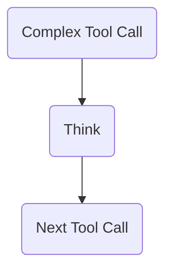

Anthropic just released some [new research](https://www.anthropic.com/engineering/claude-think-tool) about a simple technique that can help Claude (and likely other LLMs) with tasks requiring complex problem solving.

It's simple—you provide the LLM with a "think" tool it can call.

(Want to know what tools are? Check out [this guide](https://www.aihero.dev/vercel-ai-sdk-tutorial).)

The theory is that this tool is useful to give the LLM a moment to think before making a decision. It provides a structured way for the model to reflect on the information it has before proceeding.



This allows the LLM to save important information in its context, which can be used later to make better decisions. It echoes familiar concepts like ReAct and Reflexion.

Let's try implementing it.

## The Prompt

We're first going to pull out a `description` variable, which will serve as the tool's description:

```ts
const description = `
Use the tool to think about something.
It will not obtain new information or change the
database, but just append the thought to the log.
Use it when complex reasoning or some cache memory
is needed.`;
```

This text is pulled from Anthropic's article.

## The Tool

<Scrollycoding>

# !!steps

Let's start with a `streamText` call from the AI SDK:

```ts ! example.ts
import { streamText } from "ai";

const result = await streamText({});
```

# !!steps

Let's use Claude 3.7 and set a `maxSteps` of 10:

```ts ! example.ts
import { anthropic } from "@ai-sdk/anthropic";
import { streamText } from "ai";

const result = await streamText({
  model: anthropic("claude-3-7-sonnet-20250219"),
  maxSteps: 10,
});
```

# !!steps

Next, let's pass it a tool called `think`, passing the `description` we defined earlier:

```ts ! example.ts
import { anthropic } from "@ai-sdk/anthropic";
import { streamText } from "ai";

const result = await streamText({
  model: anthropic("claude-3-7-sonnet-20250219"),
  tools: {
    think: {
      description,
    },
  },
  maxSteps: 10,
});
```

# !!steps

We'll next add a `parameters` object to the `think` tool.

This object will contain a `thought` field, which is a string. The description is also taken from the article.

```ts ! example.ts
import { anthropic } from "@ai-sdk/anthropic";
import { streamText } from "ai";
import { z } from "zod";

const result = await streamText({
  model: anthropic("claude-3-7-sonnet-20250219"),
  tools: {
    think: {
      description,
      parameters: z.object({
        thought: z
          .string()
          .describe("A thought to think about."),
      }),
    },
  },
  maxSteps: 10,
});
```

# !!steps

Finally, let's add an `execute` function to the `think` tool.

This function won't do anything—it'll simply return the `thought` passed to it.

This then gets saved in the context, and in future iterations of the model, it can be used to make better decisions.

```ts ! example.ts
import { anthropic } from "@ai-sdk/anthropic";
import { streamText } from "ai";
import { z } from "zod";

const result = await streamText({
  model: anthropic("claude-3-7-sonnet-20250219"),
  tools: {
    think: {
      description,
      parameters: z.object({
        thought: z
          .string()
          .describe("A thought to think about."),
      }),
      execute: async (args) => {
        return {
          thought: args.thought,
        };
      },
    },
  },
  maxSteps: 10,
});
```

</Scrollycoding>

## Conclusion

And that's it! We've implemented the "think" tool in Claude 3.7 Sonnet.

This is a really useful technique for applying in certain situations. Anthropic recommends it for "complex tasks requiring policy adherence and reasoning in long chains of tool calls." It's a simple addition to your LLM implementation that can yield meaningful improvements in just a few lines of code.

Happy experimenting!
