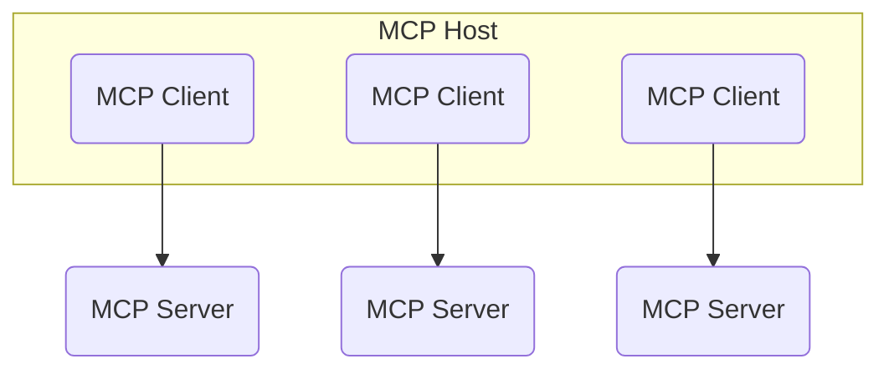
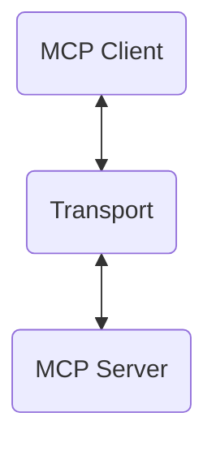
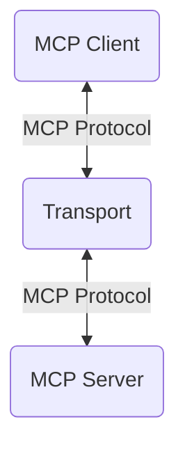

Now we understand a little bit about what MCP might be used for, and why it's interesting, let's actually look at how it works.

To understand how it works we're going to have to understand a diagram that [Anthropic posted](https://modelcontextprotocol.io/introduction), which shows the architecture of MCP:


Let's explain it step by step.

## MCP Hosts and Clients

The MCP host is the program that's going to access the MCP servers. This might be [Claude Desktop](https://claude.ai/download), [Cursor](https://cursor.sh/), [Windsurf](https://codeium.com/windsurf), or any other application that supports MCP.

This host probably uses an LLM of some kind. That LLM will be able to call tools that are defined in the MCP server.

On this host, you're going to run multiple clients - each client will maintain a relationship to a single MCP server. When the host starts up - i.e. when you start Cursor - each client will connect to an MCP server.



So, you can have one host with multiple clients, each interacting with a different server.

You can also build your own clients - and we may get to that in a future video. For now, check out [MCP's documentation](https://modelcontextprotocol.io/introduction).

## The MCP Server

The MCP server is the server that's going to be running the tools that the host wants to call.

This server could be running locally, or it could be running on a remote server.

One thing to note is that the server could be a completely different language to the host. Just like the front end and back end of an application can be in different languages, the host and server can too.

## The Transport and the Protocol

The client connects to its server using a transport. This transport is responsible for sending messages between the client and the server.



There are currently two supported transports. You can communicate via `stdio` - in other words, via the terminal. Or you can communicate through HTTP via server-sent events. This is useful if you want to run your server on a remote machine. We'll cover both of these later.

But what do the messages sent across this transport actually look like? Well, this is the protocol.



It's a set of JSON shapes that the client and server can send to each other, based on JSON-RPC 2.0. They look like this:

```ts
type Request = {
  jsonrpc: "2.0";
  id: number | string;
  method: string;
  params?: object;
};

type Response = {
  jsonrpc: "2.0";
  id: number | string;
  result?: object;
  error?: {
    code: number;
    message: string;
    data?: unknown;
  };
};
```

Requests contain a `method` that the server should perform, and the `params` that should be passed to that method.

Responses contain a `result` if the method was successful, or an `error` if it wasn't.

They each have an `id` which is used to match up the request with the response, and a `jsonrpc` field which tracks the version of the underlying `jsonrpc` protocol.

## An Example Communication

To drill this in, let's look at an example. Let's imagine we have a tool called `createGitHubIssue` which creates an issue on GitHub.

We'll skip over some of the preliminary steps - the MCP client initializing the connection - and start with the client sending a request to the server.

### 1. List The Tools

```json
// Client sends...
{
  "jsonrpc": "2.0",
  "id": 1,
  "method": "tools/list"
}
```

This is a request to list all of the tools that are available on the server. The server will respond with a list of tools:

```json
// ...server sends back:
{
  "jsonrpc": "2.0",
  "id": 1,
  "tools": [
    {
      "name": "createGitHubIssue",
      "description": "Create a GitHub issue",
      "inputSchema": {
        "type": "object",
        "properties": {
          "title": { "type": "string" },
          "body": { "type": "string" },
          "labels": {
            "type": "array",
            "items": { "type": "string" }
          }
        }
      }
    }
  ]
}
```

Note how the server responds with the name of the tool, a description, and the required inputs for the tool. The input is a JSON schema describing a title, body and labels.

### 2. Call The Tool

The client decides to call the tool, and sends a request:

```json
// Client sends...
{
  "jsonrpc": "2.0",
  "id": 2,
  "method": "tools/call",
  "params": {
    "name": "createGitHubIssue",
    "arguments": {
      "title": "My Issue",
      "body": "This is the body of my issue",
      "labels": ["bug"]
    }
  }
}
```

This describes the `name` of the tool to be called, and the `arguments` it should be passed.

The server responds with the result of the tool:

```json
// ...server sends back:
{
  "jsonrpc": "2.0",
  "id": 2,
  "content": [
    {
      "type": "text",
      "text": "Issue 143 created successfully!"
    }
  ],
  "isError": false
}
```

It returns an array of content parts. These content parts can be `text` - as shown above - or `image` (for images) and `resource` for binary data. It also returns an optional `isError` flag.

If the tool call had errored, the returned object would look slightly different:

```json
// ...if error, server sends back:
{
  "jsonrpc": "2.0",
  "id": 2,
  "content": [
    {
      "type": "text",
      "text": "Error creating issue: Unauthorized"
    }
  ],
  "isError": true
}
```

This tells the client that the tool call was unsuccessful.

## Conclusion

This is the basic structure of how MCP works. We have a host that runs clients, which connect to servers. The clients and servers communicate using a transport and a protocol.
