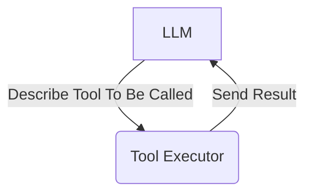
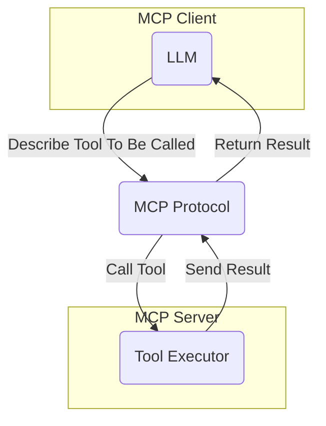

If you want to get your LLM to do useful things in the world, you will quickly hit a problem.

All the useful things in the world, like Slack, GitHub, or even your local filesystem, provide their own unique API to access them.

So, you end up writing a ton of code to glue your LLM and those APIs together.

Want to add a new tool? That's more glue code. Grim.

## The Model Context Protocol

The [Model Context Protocol](https://github.com/modelcontextprotocol/docs) acts as a layer between your LLM and those APIs. It's an [open standard](https://www.anthropic.com/news/model-context-protocol) that enables developers to build secure, two-way connections between their data sources and AI-powered tools.

It can specify a bunch of 'tools' which the LLM can call. For GitHub, that might be 'fetch repository', or 'comment on PR'.

Instead of your LLM having to learn the entire GitHub API, it can receive a LLM-friendly interface to interact with. And then the MCP server can contain the code which contacts the different APIs.

Usually, your LLM will be inside a desktop application, like [Cursor](https://cursor.sh/), [Windsurf](https://codeium.com/windsurf), or [Claude Code](https://docs.anthropic.com/en/docs/agents-and-tools/claude-code/overview). These applications can then provide a user-friendly way to connect your LLM to the tools it needs.

## Don't I Still Have To Write The Code?

You might be looking at the diagrams above and be a bit puzzled. Haven't we just moved the glue code to a different place?

The difference is that the glue code is now in its own reusable package. If you want to build your own MCP server, you can reuse it across all of the clients that want to access it, like Cursor, Windsurf, or Claude Code.

But what's more likely is that you'll just use a pre-built server. There are [thousands of example MCP servers](https://github.com/modelcontextprotocol/servers) heading to npm, and you can just pick the one that fits your needs.

## What Does This Enable?

To use [Anthropic's analogy](https://docs.anthropic.com/en/docs/agents-and-tools/mcp), MCP is like a USB-C port for your LLM. It's a standard interface through which it can communicate with a wide range of tools.

This means that you can design your own workflows picking and choosing the right tools for the job without fear that it's going to be a nightmare to integrate.

In the future, we might see a marketplace of different MCP servers each allowing the user to interface with a different API.

I'm personally excited because it allows me to build tools that help my content workflow. I'll be talking about some of those during this tutorial.

## Why Not Just Give The LLM The API?

When I was posting about this online, a common comment was "aren't LLMs smart enough to learn the API themselves?".

In theory, the answer could be yes. Most publicly available APIs provide some sort of documentation for how to use them. In theory, you could feed that into an LLM, and it would work out how to achieve its goals using the documentation.

But in practice, this approach is slow. As user-centric developers, we want to provide the fastest experience we can. And having the tools available to the LLM in a format that's easily consumable makes the process a lot faster.

## OpenAI's Support

The Model Context Protocol has gained significant industry backing. [Sam Altman announced](https://x.com/sama/status/1904957253456941061) that OpenAI will be supporting MCP across its products, starting with the Agents SDK and expanding to ChatGPT Desktop and the Responses API. This endorsement from OpenAI signals MCP's growing importance in the AI development ecosystem.

## Isn't This The Same As Tool Calling?

Another comment I got when I posted this article online was "how similar is this to tool calling?"

Tool calling is a way for LLMs to invoke functions to do things in the real world. The LLM is paired with a tool executor of some kind, which calls the tool and returns the result to the LLM:

However this pairing usually happens from within the same process. In other words, within the same server, or the same desktop application.

MCP is a way to provide tools to the LLM which it can call _from a seperate process_. This can be running locally, or on a remote server:

The key difference is that the MCP server is completely decoupled from the client.
