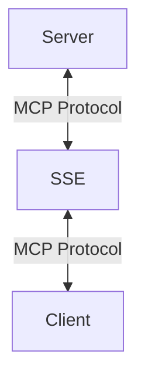

The model context protocol doesn't just work over `stdio`. It can also work over HTTP.

The protocol uses something called [server-sent events](https://developer.mozilla.org/en-US/docs/Web/API/Server-sent_events/Using_server-sent_events) (SSE). This allows the server to push data to the client in real-time over a single HTTP connection.



This means that the server can be hosted on the cloud, and the client can communicate with it via an HTTP connection.

Let's look at how that works.

## Setting Up The Server

We'll start with a simple server that we had in a [previous example](https://www.aihero.dev/mcp-server-from-a-single-typescript-file). This is a server with a single tool that returns the weather in a city.

```ts
import { McpServer } from "@modelcontextprotocol/sdk/server/mcp.js";
import { z } from "zod";

const server = new McpServer({
  name: "Weather Service",
  version: "1.0.0",
});

server.tool(
  "getWeather",
  {
    city: z.string(),
  },
  async ({ city }) => {
    return {
      content: [
        {
          type: "text",
          text: `The weather in ${city} is sunny!`,
        },
      ],
    };
  },
);
```

## Setting Up The Transport

To get this example working we'll use `express`.

_NOTE: I attempted to get this working with [Hono](https://hono.dev/docs/), but the model context protocol SDK appears to only work with Express. Let's hope they fix that soon, since Hono is much better._

<Scrollycoding>

# !!steps

First we'll import express and initialize a new app.

```ts ! example.ts
import express from "express";

const app = express();
```

# !!steps

Then we'll create a route to handle the initial SSE connection request.

This route will be used to handle new connections to the server.

```ts ! example.ts
import express from "express";

const app = express();

app.get("/sse", async (req, res) => {
  // implementation
});
```

# !!steps

When we get a new connection, we'll create a new SSE transport from it and save it to a local variable.

This approach is pretty limited - it only allows for one connection at a time. We'll explore a better approach later.

```ts ! example.ts
import express from "express";
import { SSEServerTransport } from "@modelcontextprotocol/sdk/server/sse.js";

const app = express();

let transport: SSEServerTransport | undefined =
  undefined;

app.get("/sse", async (req, res) => {
  transport = new SSEServerTransport();
});
```

# !!steps

We add `/messages` as the path for the transport. We'll implement the `/messages` endpoint in a minute.

We also pass the response object (`res`) to the transport. This is used to send messages back to the client.

```ts ! example.ts
import express from "express";
import { SSEServerTransport } from "@modelcontextprotocol/sdk/server/sse.js";

const app = express();

let transport: SSEServerTransport | undefined =
  undefined;

app.get("/sse", async (req, res) => {
  transport = new SSEServerTransport("/messages", res);
});
```

# !!steps

We'll then connect the server to the transport.

```ts ! example.ts
import express from "express";
import { SSEServerTransport } from "@modelcontextprotocol/sdk/server/sse.js";

const app = express();

let transport: SSEServerTransport | undefined =
  undefined;

app.get("/sse", async (req, res) => {
  transport = new SSEServerTransport("/messages", res);
  await server.connect(transport);
});
```

</Scrollycoding>

```ts ! example.ts
// Full route
app.post("/messages", async (req, res) => {
  if (!transport) {
    res.status(400);
    res.json({ error: "No transport" });
    return;
  }
  await transport.handlePostMessage(req, res);
});
```

## Handling Messages

Now, let's implement the `/messages` route.

<Scrollycoding>

# !!steps

First we'll create the route.

```ts ! example.ts
app.post("/messages", async (req, res) => {
  // implementation
});
```

# !!steps

Then we'll check if we have a transport. If we don't, we'll return an error.

```ts ! example.ts
app.post("/messages", async (req, res) => {
  if (!transport) {
    res.status(400);
    res.json({ error: "No transport" });
    return;
  }
});
```

# !!steps

Finally, we'll call the transport's `handlePostMessage` method. This will handle the message and send a response back to the client.

```ts ! example.ts
app.post("/messages", async (req, res) => {
  if (!transport) {
    res.status(400);
    res.json({ error: "No transport" });
    return;
  }
  await transport.handlePostMessage(req, res);
});
```

</Scrollycoding>

Finally, we'll start the server.

```ts
app.listen(3000, () => {
  console.log("Server started on port 3000");
});
```

## Testing It Out

Now we can test it out. We can run our file using a similar trick to the one we used in the [previous example](https://www.aihero.dev/mcp-server-from-a-single-typescript-file) - using `npx` and `tsx`.

```bash
npx tsx ./path-to-file.ts
```

Instead of Claude Code, let's connect to Cursor instead. Cursor lets you add MCP servers to power up its 'agent' mode. I'll let you follow the [instructions on their docs](https://docs.cursor.com/context/model-context-protocol#adding-an-mcp-server-to-cursor).

1. To add an MCP server to Cursor, go to `Cursor Settings > Features > MCP` and click on the `+ Add New MCP Server` button.
2. Choose `Type` as `sse`.
3. Give the server a name, like `Weather Example`.
4. Enter the URL of the server: `http://localhost:3000/sse`.

Once done, you can test it out by asking Cursor your city's weather.

## Conclusion

In this example, we saw how to use the model context protocol over HTTP using server-sent events. This allows for MCP servers to be hosted on the cloud and for clients to communicate with them over an HTTP connection.

This server has one important weakness - it can only connect to a single client at a time. We'll look at how to address this in a future example.
