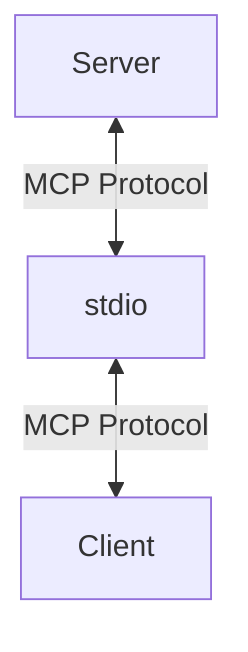
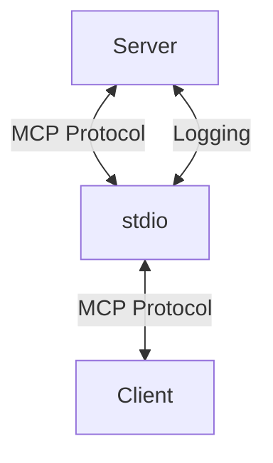
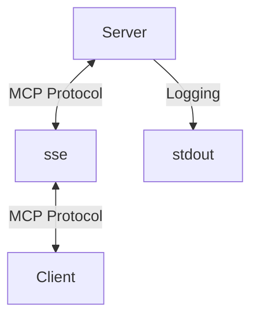

There's a really easy foot gun that you can trigger when you're using the standard io transport with an MCP server.

Here it is: console logs don't work.

## Why `console.log` Doesn't Work

An MCP server is really just a standard Node application. The client runs the MCP server, and monitors the `stdout` of the server for any MCP messages. It then sends back MCP messages to the server's `stdin`.



However, Node apps use stdio for another purpose: logging. When you log to the console, you're writing to the same stream that the MCP server is using to communicate with the client.



This means that if you log to the console in your server, you're going to be sending messages to the client that aren't MCP-formatted. Depending on the client, this could cause it to crash. And at the very least, your logs will be swallowed by the program consuming them.

## Why Doesn't `sse` Have This Problem?

The `sse` transport doesn't have this problem because it doesn't use `stdio` for transporting messages:



This means that it's free to use `stdout` for logging.

It's perfectly possible to use `sse` locally, so you may prefer using that method if accessing the console is important to you.

## How to Log

My preferred solution is to create a custom logger that writes to a local file - `mcp-server.log`. Here's my implementation:

```ts
// 1. appendFileSync
import { appendFileSync } from "fs";
import { join } from "path";

// 2. LOG_FILE
const LOG_FILE = join(
  import.meta.dirname,
  "mcp-server.log",
);

// 3. formatMessage
function formatMessage(
  level: string,
  message: string,
  data?: unknown,
): string {
  const timestamp = new Date().toISOString();
  const dataStr = data
    ? `\n${JSON.stringify(data, null, 2)}`
    : "";
  return `[${timestamp}] [${level}] ${message}${dataStr}\n`;
}

// 4. logger
export const logger = {
  log(message: string, data?: unknown) {
    const logMessage = formatMessage(
      "INFO",
      message,
      data,
    );
    appendFileSync(LOG_FILE, logMessage);
  },
  // ...
};
```

1. We use `appendFileSync` to write to a file synchronously.
2. We define the path to the log file.
3. We define a function to format the message.
4. We export a logger object with a `log` method that writes to the log file. You can export other methods like `error`, `warn`, etc.

This way, you can log to a file without interfering with the MCP protocol.

## Conclusion

You've got two choices when you're considering logging in an MCP server:

- Use a transport that doesn't interfere with `stdout`, like `sse`.
- Write to a `.log` file.
