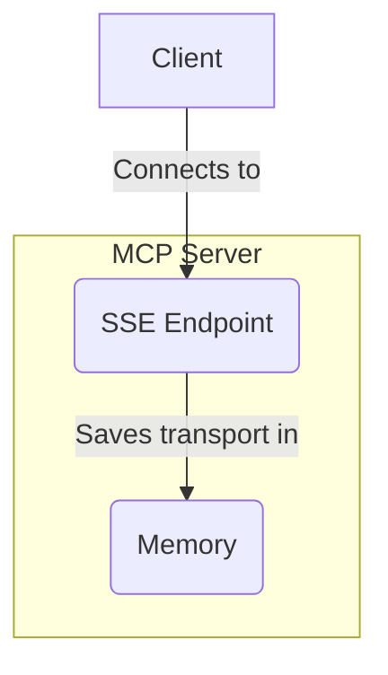
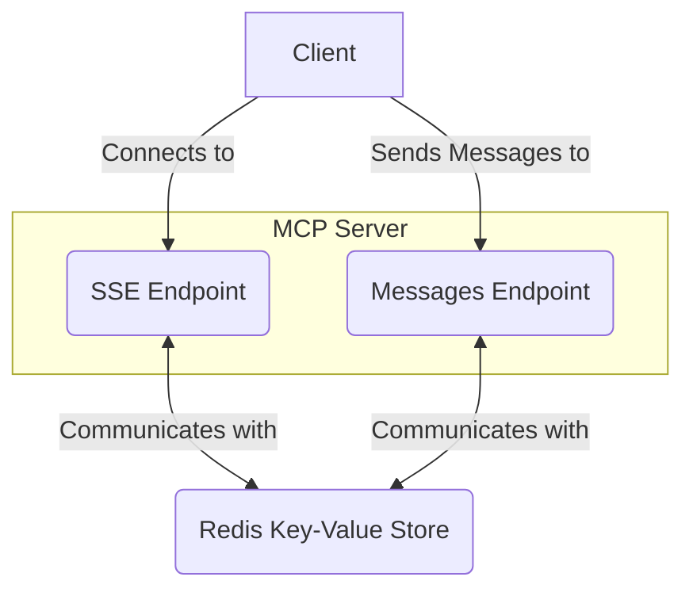

In a [previous example](https://www.aihero.dev/serving-mcp-servers-over-http), we created a simple MCP server that could be served over HTTP.

**But it had some downsides**.

## One Client At A Time

The most obvious is that **it could only serve one client at a time**. It saved its current 'transport' in a single variable:

```ts
import { SSEServerTransport } from "@modelcontextprotocol/sdk/server/sse.js";
import express from "express";

// The transport variable
let transport: SSEServerTransport | undefined =
  undefined;

const app = express();

app.get("/sse", async (req, res) => {
  transport = new SSEServerTransport("/messages", res);
  await server.connect(transport);
});
```

This meant that if **a second client connected, the first client would lose connection**.

## Stateful Server

But let's imagine that we fix this. Instead of saving the transport in a single variable, we'd store it using an id where we could later retrieve it.

Even if we did this, we'd still have a problem.

**This approach requires a stateful server.** We'd need to keep track of the transports in memory. If the server process exits, the transports would be lost.



This puts constraints on how the server can be deployed. **Serverless environments like Vercel or AWS Lambda would not work** - they dispose of in-memory state between requests.

We'd need to deploy it to a **long-running server**, like a VPS.

## Store The State In Redis

A better approach is to **store the state in a database**. We could use a key-value store like Redis.



Now the transport information is stored in Redis, **the server can be stateless**. This means it can be deployed to serverless environments.

## Vercel Example

This is the approach that `mcp-on-vercel` has taken. I recommend **checking out [their repo](https://github.com/vercel-labs/mcp-on-vercel)** to learn more.

While their repo is designed to work with Vercel, it **can be adapted to fit to any serverless platform**.

## Conclusion

MCP servers are stateful by nature. But by storing the state in a database, we can deploy them to serverless environments.

This would be my recommended approach for deploying MCP servers to production.

However, it does beg the question: was there a way of designing this protocol so that the service could be stateless?

Having to hook up a key-value store feels like more overhead than necessary. Could the client not store the state instead?

I'll explore this in a future article.
