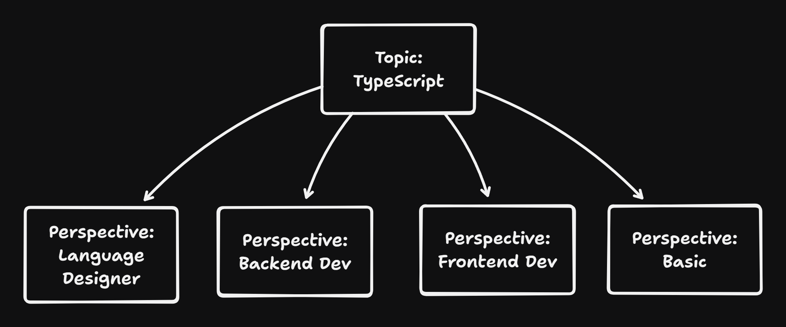

I came across a really cool paper today. It's trying to address a really hard problem: writing really good articles from scratch.

It's called [STORM](https://arxiv.org/pdf/2402.14207). Not only is it a cool name, But it's a really great example of a very complex AI workflow.

So while you may not be interested in the domain of generating articles, Storm is a great paper To look at if you want to build better ai workflows.

Let's take a look.

## Multiple Perspectives Create Better Articles

There are two main ideas behind STORM. The first is that the best way to understand a problem deeply is to ask an expert. The process of asking questions, receiving answers, and generating follow-up questions naturally pulls you deeper into a topic.

The second is that people with different perspectives on a topic ask different questions. If you want to write an article about TypeScript, beginners will have different questions than experienced developers. Backend developers will have different questions than frontend developers. These different perspectives enrich the question and answering process.

So STORM breaks down the process of writing something into four steps:

- The topic chosen
- The questions generated
- The outline created
- The final article

However, the devil is in the details.

## Creating Perspectives

Let's dive into the workflow aspect of this. The first step in the workflow is to create perspectives - the different ways of looking at a topic.

The storm paper did this by:

1. Retrieving and analysing Wikipedia articles from similar topics
2. Asking a LLM to generate different perspectives based on the topic.

Each 'perspective' was put in the role of a Wikipedia editor with a specific topic focus. Since each perspective would be focusing on only one aspect of the topic, they also provided a 'basic' perspective which would cover the basic information.

Then each perspective was put into a conversation with an expert. This expert had access to trustworthy online sources.
