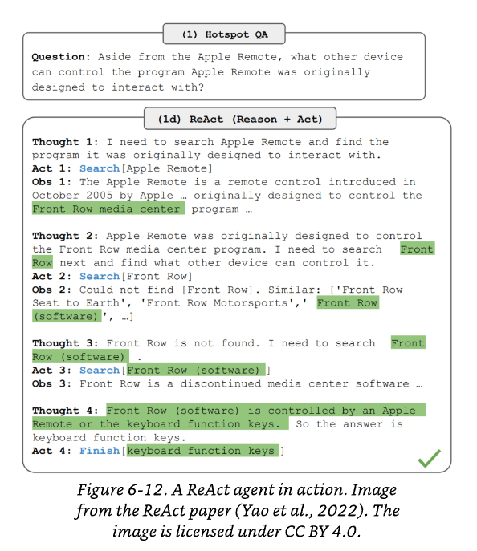

How do you count how many tokens are in a text file?

---

How do you evaluate your embedding model?

---

https://www.pinecone.io/learn/chunking-strategies/

---

https://research.trychroma.com/evaluating-chunking

---

https://platform.openai.com/docs/guides/prompt-engineering

---

Effect TS is selling itself as a really great way to structure AI apps.

This feels to me like a bit of bandwagon jumping. Effect is very compelling for certain use cases. The fact that it bundles up so much stuff into a standard library is pretty nice.

But it's a huge learning curve for what you can patch together with a bunch of other JavaScript libraries which people already know.

Personally, I don't see the particular appeal of using Effect with AI. Especially since the AI chains are not particularly complicated.

---

A real-time canvas app would be a really interesting use case for AI.

---

You can add a human in the loop at any point during an AI agent's actions. They can validate plans, generate plans, and even execute plans.

So "human in the loop" doesn't have to mean that the human only intervenes during risky operations. The human can be involved in multiple stages during the process.

---

Reflection will significantly boost the agent's performance. You check whether the plan is good and if it's a bad plan, generate a new one. This is even before receiving any input from the outside world via tool calls.

---

One open question is how well foundation models can plan.

Many researchers think that foundation models cannot plan at all.

Instead of actually planning they are simply retrieving things from their corpus that look like plans.

However this may be because we don't know how to use LLM's the right way in order to generate plans.

---

Planning is, at its core, a search problem. You search among different paths to the goal, you predict the outcome of each path and you pick the path with the most promising outcome.

Making plans as if through a maze often requires backtracking. You reach a dead end and you have to backtrack to a certain point.

Some say that models can only generate forward actions. They can't go backwards to generate alternate actions.

It's also possible that language models are poor planners because they aren't given the tools necessary to plan.

It's necessary to know the outcome state to determine whether to take an action or not.

---

This paper argues that an LLM, by containing so much information about the world, is capable of predicting the outcome of each action.

https://arxiv.org/abs/2305.14992

---

It might be possible to augment an LLM with a search tool and a state tracking system to help it plan.

---

The whole field—from agents to RAG to tool calling to structured outputs—is all about prompt engineering. The only things that aren't about prompt engineering are about changing the weights of the model. That can be done either via pre-training or via fine-tuning.

But it's really incredible how much you can get out of the model you have.

---

How do you make an agent better at planning? It's all about prompt engineering, of course. You can write a better system prompt with more exemplars.

The exemplars look like this: You provide an example of the task and then you provide an array of possible tools that the model can call in order to fulfill the task.

Task: "Tell me about product X"
Tools: [`get_product`, `get_price`, `get_reviews`]

---

Stronger models are better at planning.

---

It's worth thinking about rewriting tools themselves to make them simpler. Refactoring a complex tool into two simpler tools can make it more obvious to the LLM what it's supposed to do with the tools. Then it will end up being better at planning with the tools.

---

Different queries might need different tools. Many APIs let you specify a list of declared tools to be used per query.

You can also specify that the model must use a tool, use no tools, or set it to auto: where the model decides which tools to use.

---

The amount of granularity in the planning is also an interesting vector.

Detailed plans are harder to generate but easier to execute. High-level plans are easier to generate but harder to execute.

---

One way to think about model planning is to plan hierarchically. You get one agent to plan for the quarter, then another agent to plan for the month, another one to plan for the week. That way, you get the benefit of high-level planning, seeing the big picture, but also understanding the day-to-day stuff.

---

One way to think about plans is they are essentially just plans to call different tools. Each step is simply a tool call. So at the start of your model's planning session, it's simply going to map out the tool calls that it needs in order to achieve the end result.

However, this couples the name of your tool calls to the plan. Another way to think about it is to plan in more natural language. This makes your plan generator more robust to changes in tool APIs.

You then need a model to translate each natural language action into executable commands. However, this is a much less resource-intensive task than generating the plan in the first place. So it can be done by a weaker model.

---

How do you make agents generate sequential or parallel plans? How do you make them consider if statements? What about for loops?

[Examples of different control flows](./image.png)

---

Parallel execution is a really key part of agent planning. If the agent can effectively parallelize its plans, it means the latency for the end user is much lower.

Does the system need to browse ten websites simultaneously? If so, parallelizing that process is going to be massively important for the end user.

---

Reflection and error correction isn't strictly necessary for an agent to operate. But it is necessary for an agent to succeed.

You can use reflection in many different places:

- After receiving a user query to evaluate if the request is feasible.
- After the initial plan generation to evaluate whether the plan makes sense.
- After each execution step to evaluate if it's on the right track.
- And after the whole plan has been executed to determine if the plan has been completed.

---

Interleaving reasoning and action has become a common pattern for agents. This was first proposed in the ReAct paper.

https://arxiv.org/abs/2210.03629

---

Here's a really good example of ReAct: Reasoning and action working together.

The key format is to have three different outputs of each step:

1. Thought: The reasoning behind the action
2. Act: The action itself
3. Observation: The result of the action

---

Reflexion:

In Reflexion, you have two modules:

1. An evaluator that evaluates the outcome
2. A self-reflection module that analyzes what went wrong.

Reference: https://arxiv.org/abs/2303.11366

[An example of Reflexion in action]

---

The downside of both ReAct and Reflexion is that thoughts, observations, and actions can take a lot of tokens to generate.

This increases cost and user-perceived latency.

To get their agents to follow the format, both ReAct and Reflexion authors used plenty of examples in their prompts.

---

There's no foolproof guide on how to select the best set of tools for your agent. Chameleon uses thirteen tools, Guerrilla uses one thousand six hundred and forty-five tools.

---

There's no foolproof guide on how to select the best set of tools for your agent. Chameleon uses thirteen tools, Gorilla uses one thousand six hundred and forty-five tools.

[Chameleon](https://arxiv.org/abs/2304.09842)
[Gorilla](https://arxiv.org/abs/2305.15334)

---

The more tools there are, the harder it is for LLMs to efficiently use them.

It's hard for humans to master a large set of tools.

Giving agents a set of primitives which they can compose into larger tools is really key.

---

To understand how to evaluate an agent, you need to understand its failure modes. The more complex a task that the agent performs, the more failure modes there are.

Agents have unique failures caused by planning, tool execution, and efficiency.

Agents may fail to plan properly. They might generate a plan with several errors. There might be invalid tool use: they might call a valid tool, but call invalid parameters. It might call valid parameters, but pass incorrect values to those parameters.

---

Agents might simply fail to achieve their goal. Imagine you ask an agent to plan a holiday. It might:

- Forget to book you a hotel
- Forget to organize flights
- Organize flights from the wrong location

An agent may also fail to follow constraints properly. If the trip should:

- Cost no more than $5,000, it might book a trip that costs $10,000
- Last no more than a week, it might book a trip that lasts two weeks

---

To evaluate an agent for planning failures, you can create a planning data set where each example is a tuple of task and tool inventory.

You can then compute the following metrics:

- Checking how many of the generated plans are valid
- How many plans did the agent have to generate to get a valid plan
- Out of the tool calls generated, how many of them are valid
- How often are invalid tools called with invalid parameters

You can then analyze the agent's outputs for patterns. What tools did the model frequently make mistakes with? Some tools might be harder for an agent to use.

---

A question I have is whether you use a planner that has access to only hypothetical tools.

It would generate a natural language output which could then be evaluated on its own merits.

Then you could pass that into a translation module which would run the actual tool calls and execute the plan.

I wonder whether this would circumvent some of the issues that folks report when passing LLMs a too-large tool inventory.

---

When you're evaluating your agents, you also need to evaluate efficiency—how efficient is the agent at the task.

Efficiency means lower cost and lower latency. But of course, efficiency is always on a separate axis to accuracy.

---

One thing that's interesting about AI agents is that they have different definitions of efficiency. For a human to check 100 web pages it's extremely inefficient. For an AI agent to check 100 web pages it's very very efficient because it can parallelize it.

---

What is the difference between generative AI and predictive AI? This is something I need to look further into.