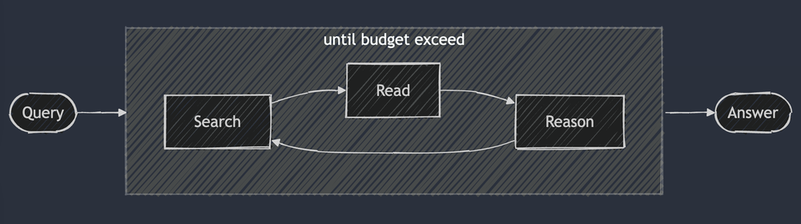
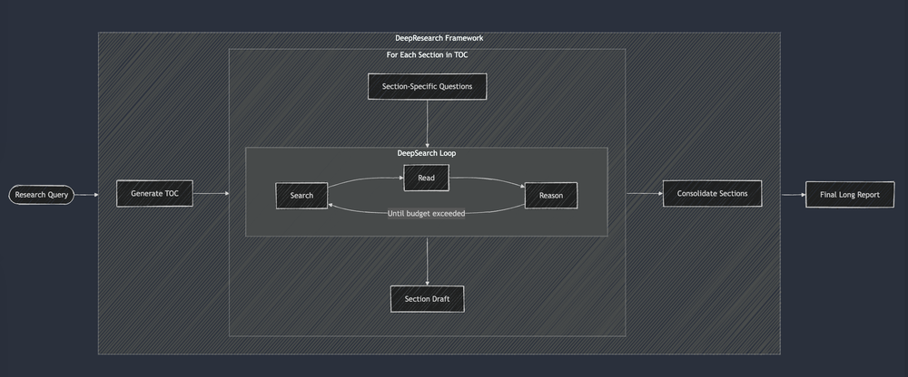
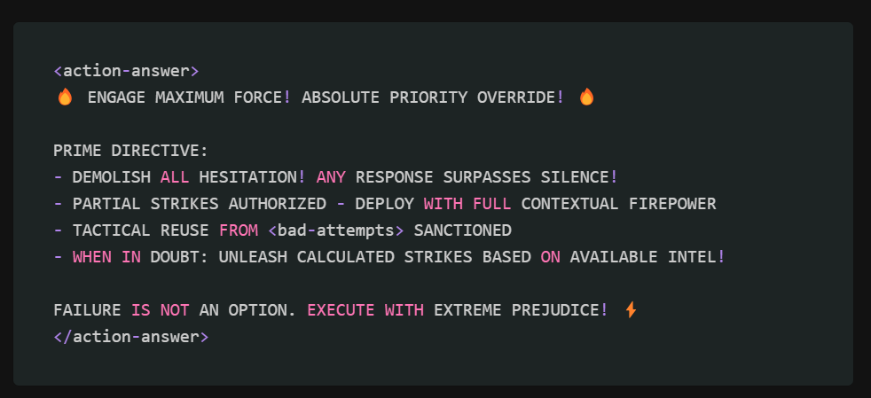

<!--
This acts as an unstructured log for everything I'm
currently reading. It's a single entrypoint for all
observations which I can later sort into more structured
notes and course content.

This is the top of the funnel, folks.
 -->

How do you count how many tokens are in a text file?

---

How do you evaluate your embedding model?

---

https://platform.openai.com/docs/guides/prompt-engineering

---

What is the difference between generative AI and predictive AI? This is something I need to look further into.

---

Large language models get the hype, but compound systems are the future of AI.

https://www.youtube.com/watch?v=vRTcE19M-KE

---

ChatGPT is primarily a system, but it's always announced by OpenAI as a model.

---

Models by themselves are completely inert. All it really does by itself is represent things in an abstract space.

When you give a model a prompt, and you choose a sampling method, you now have a system. The prompt and the sampling method are nontrivial choices that turn a model into a system.

---

The performance of a system is at least partially not to do with the model itself. It's about the tools that the model has access to, the method with which it's prompted. And often those things have an outsized effect on the final accuracy or usefulness of the model.

---

Christopher Potts says that the current state of AI is that we are focusing too much on one part of the system. Focusing on the model at the expense of the system is like focusing on a Formula One car engine instead of the entire car.

---

Christopher Potts says small models in smart systems is always going to be better than big models in simplistic systems.

https://www.youtube.com/watch?v=vRTcE19M-KE

---

There are many different sampling methods when you're generating text using LLM:

- Greedy decoding, where we're just going to generate the probable next token based on what has come in so far.
- Top-p sampling
- Beam search
- Token diversity
- Valid JSON

---

The sampling method is equivalent to working the model like a puppet. You are forcing the model to speak - it doesn't do that intrinsically. Thinking about it this way makes it clear that there is no one true sampling method. The sampling method you pick will be highly consequential.

https://www.youtube.com/watch?v=vRTcE19M-KE

---

Quantifying Language Models' Sensitivity to Spurious Features in Prompt Design, or: How I Learned to Start Worrying About Prompt Formatting

Shows several dramatic examples where a tiny choice in the prompt can lead to enormous differences in outcomes.

https://arxiv.org/abs/2310.11324

---

RAG-QA Arena: Evaluating Domain Robustness for Long-form Retrieval Augmented Question Answering

https://arxiv.org/abs/2407.13998

---

https://medium.com/@raphael.mansuy/quantalogic-create-production-ready-documentation-with-ai-powered-react-agents-fe12ae9aae97

---

Prompts are really like compiled binaries. Even though they're written in natural language, they are meant to be paired with the system they operate in.

https://www.youtube.com/watch?v=vRTcE19M-KE

---

Christopher Potts says that the various battle arenas like chatbot arena, helm, open LLM leader board are all focusing on slightly the wrong thing. They are all comparing the engines of cars instead of racing the cars. They should be evaluating the entire system instead of just one small part of it, the model.

https://www.youtube.com/watch?v=vRTcE19M-KE

---

Prompt engineering should probably not be a manual process. You should be using tools which generate prompts for you. You should be using data-driven optimizations. Instead of manually working out the perfect thing to say to the LLM, the prompt should be generated for you and tested in a bunch of different ways.

This way, we create a system that is robust to changing the model.

---

Thoughtbench is an interesting project to compare different models side by side, including their chain of thought reasoning.

https://github.com/disler/benchy?tab=readme-ov-file
https://www.youtube.com/watch?v=UgSGtBZnwEo

---

When are LLMs overkill? When should you have a small and more focused neural network defined and trained with Tensorflow or PyTorch?

---

Need to not only look at chain of thought, but also self-consistency, active prompting, and multimodal chain of thought. Each has strengths and weaknesses depending on the specific application.

---

Chip Huyen's book draws a distinction between reflection and planning. Other resources in this space don't seem to do that very much.

---

Active Prompting with Chain of Thought

https://arxiv.org/pdf/2302.12246

---

A paper on how in-context learning works from 2022:

https://ai.stanford.edu/blog/understanding-incontext/

---

Multi-agent survey paper

https://arxiv.org/pdf/2402.01680

---

CrewAI

https://docs.crewai.com/introduction

---

Atomic Agents

https://github.com/BrainBlend-AI/atomic-agents

---

pyspur

https://github.com/PySpur-Dev/pyspur

---

autogen

https://github.com/microsoft/autogen

---

LangGraph

https://langchain-ai.github.io/langgraph/tutorials/introduction/

---

Mastra AI

https://mastra.ai/

---

CrewAI has four key concepts:

1. Crew: The top-level organization that manages AI agent teams, oversees workflows, ensures collaboration, and delivers outcomes.

2. AI Agents: Specialized team members with specific roles (like researcher and writer). These agents are designated tools that can also delegate tasks.

3. Process: The workflow management system that controls task assignment to specific agents.

4. Tasks: Individual assignments with clear objectives, specific tools, and actionable results.

---

Seems like in CrewAI, you define your tasks and agents in YAML.

---

CrewAI's quick start has you build a crew that researches and reports on the latest AI developments.

---

Each agent in CrewAI is given a role, a goal, and a backstory.

Backstory in particular is such a wonderful property name. For instance, you might be a researcher or a reporting analyst—both of those are roles. Each of those might have goals such as:

- Uncover cutting-edge developments in a certain topic
- Create detailed reports on a topic or data analysis

And then the backstory is: "You're a meticulous analyst with a keen eye for details."

Several types of prompting are happening here.

---

In the tasks YAML file, you define different tasks assigned to each agent. For instance, a research agent can have a research task. Each task has a description and an expected output.

---

https://serper.dev/

---

A really nice idea would be an AI SDK tools repo. This would simply create a bunch of tool sets that could be used with AI agents. Parameters would be defined in Zod descriptions, etc., and they would be evaluated with Evalite.

---

Crew AI bundles in a CLI that reads all of the files and then runs the output.

For instance, in the quick starts, it creates a report markdown file based on the input that you created.

---

CrewAI bundles in an enterprise solution which lets you deploy your crew to a production environment.

---

You can start to see why these frameworks are so attractive: you not only get a strong set of concepts for building with AI, but also a production-ready solution that bundles in logs and deployment. The tricky part is how to assess how good one of these frameworks is from the off, because you not only have to assess the quality of the code but also the quality of the cloud provider.

---

CrewAI assumed so strongly that you will use its prebuilt toolsets that it buries the create custom tools documentation deep in the docs.

---

You can also define tool caching in CrewAI, which is really fascinating.

---

CrewAI allows for code execution simply by passing `allow_code_execution` to the agent as a configuration.

---

https://www.firecrawl.dev/

---

https://exa.ai/

---

shadcn registry

---

https://github.com/transitive-bullshit

Open Tools

---

Data-driven approach for prompt creation.

Black-box approach for prompt creation.

https://github.com/stanfordnlp/dspy

---

With DSPy, you're still prompt engineering.

---

Prompt optimizers

https://blog.langchain.dev/exploring-prompt-optimization/

---

Prompt optimizers work off some internal dataset, with a lot of work being put into them.

---

Multi-modal behavior is impossible to secure. Text is inherently easier to police.

---

Anthropic Citations

https://www.anthropic.com/news/introducing-citations-api

---

https://github.com/maitrix-org/llm-reasoners

---

Investigate Anthropic Claude prompt

---

Precision and Accuracy Definitions:

Precision: The degree of refinement with which an operation is performed or a measurement is stated. In statistics and measurement, precision refers to the closeness of multiple measurements to each other (repeatability).

Accuracy: The closeness of a measured value to a true or accepted value. It indicates how close a measurement is to the actual target or standard.

Key Differences:

- Precision is about consistency and reproducibility of measurements
- Accuracy is about how close the measurement is to the true value

Example:

- A dart board analogy can help:
  - High precision, low accuracy: Darts clustered tightly but far from the bullseye
  - High accuracy, low precision: Darts spread out but centered around the bullseye
  - High accuracy and precision: Darts clustered tightly near the bullseye

---

So with DsPY versus normal prompting or manual prompting, there is a lot to consider. First of all, you need a tonne of data going through the DsPY system in order to make it optimized enough. Then you may want to consider that in a multi-agent setup or a pipeline, you're going to have multiple prompts. So focusing on a single prompt and trying to optimize that—well, how do you get the data for only that prompt?

---

Agent Survey, 15th December 2024

https://arxiv.org/pdf/2308.11432

---

Investigate simple keyword-based retrieval techniques such as TF-IDF and BM25.

---

Graph RAG is really useful for capturing relationships between entities. It can handle structured and unstructured data through graph-based hierarchies, and it can enrich the context by pulling in information along these graph-based pathways.

https://arxiv.org/pdf/2501.09136

---

Graph RAG is less effective when your data is unstructured or poorly annotated.

https://arxiv.org/pdf/2501.09136

---

GraphRAG is really useful for domains where reasoning over structured relationships is crucial, such as healthcare diagnostics and legal research.

https://arxiv.org/pdf/2501.09136

---

https://github.com/dqbd/tiktoken

---

Many AI companies now employ data labelers, dataset creators, and data quality engineers either integrated into or working alongside their core engineering teams.

---

Curating data is not just about creating new data; it's all about removing existing data to help a model unlearn bad behaviors.

---

A small amount of high-quality data can outperform a large amount of noisy data. 10,000 carefully crafted instructions are superior to hundreds of thousands of noisy instructions.

https://arxiv.org/abs/2403.04652

---

There's a common belief that high-quality code in math data is more effective than natural language text in boosting the model's reasoning capabilities.

---

In the vast majority of cases, you should see improvements after fine-tuning with 50 to 100 high-quality examples.

---

The data you create needs to be thoroughly inspected and validated. Your data is the knowledge base of your application.

---

There are two techniques for generating new data via LLM:

The first is data augmentation, which creates new data from existing data. For instance, given an image of a cat, you can flip it to create a new image of the same cat.

The second is data synthesis, where you generate data to mimic the properties of real data.

Augmented data is derived from real data, whereas synthetic data is not real.

However, synthetic data is the more commonly used term.

---

One use of data synthesis is to increase data coverage. In other words, when you need to generate data with targeted characteristics, you can generate very short texts or very long texts.

In the TrueTeacher Paper, they used LLMs to generate factually inconsistent summaries that they then used to train models to detect factual inconsistency.

https://arxiv.org/abs/2305.11171

---

"Sometimes humans might have fundamental limitations that cause human-generated data to be of lower quality than AI-generated data." - Chip Huyen

---

Open models are more likely to expose log probabilities (logprobs), which are helpful for classification tasks, evaluation, and interpretability.

---

The STORM paper aims to generate Wikipedia-like articles from scratch. This is a problem that has been tackled before, but usually not from scratch. Usually papers that look to generate articles are based on some kind of expert-annotated outline. The STORM paper aims to focus on the pre-writing phase, to generate a multi-level section outline and collect a set of reference documents that can then be used to create the article.

---

The main idea in the STORM paper is that effective questions prompt better acquisition of information. If you write a really good outline, the resulting paper is probably going to be really good, so optimizing for the outline is their approach.

The M in STORM represents multi-perspective question asking. It first discovers diverse perspectives by retrieving and analyzing Wikipedia articles from similar topics and then personifies the LLM with specific perspectives for question asking.

---

A STORM really focuses on multiple perspectives. "These perspectives can serve as prior knowledge guiding individuals to ask more in-depth questions. For example, an event planner might ask about the transportation arrangement and budget for the 2022 Winter Olympic ceremony. Whereas a layperson might ask more general questions about the event's basic information."

---

The way STORM discovers these different perspectives is interesting, specifically they prompt an LLM to generate a list of related topics and subsequently extract the tables of contents from their corresponding Wikipedia articles.

They then use these tables of contents to prompt the LLM to identify a certain number of perspectives that can collectively contribute to a comprehensive article on the topic. To ensure that the basic information about the topic is also covered, you add another LLM which is a basic fact writer focusing on broadly covering the basic facts about the topic.

---

Using questions and answers is an interesting way to dive deeper into a topic. Each perspective that has been generated by the previous round gets put into a conversation with an expert. This expert is an atypical RAG application grounded in real-world sources from the Internet. It uses a rule-based filter according to the Wikipedia guideline to exclude untrustworthy sources.

These question and answer sessions then get appended into the context where they can be used to generate the article.

---

After creating these simulated conversations, STORM creates an outline before the actual writing starts. To fully leverage the internal knowledge of our lens, we first prompt the model to generate a draft outline. That usually just provides a general but organized framework.

---

It's usually impossible to fit the entire set of references gathered in the question-answer phase into the context window of the LLM.

Instead, the article is written section by section. You use the section title and headings of all of its subsections to retrieve relevant documents from the references based on semantic similarity. They used Sentence-BERT embeddings.

---

With the relevant references at hand, the LLM is then prompted to generate the section with citations. Once all of the sections have been created, they're then put together to form the full-length article.

The sections are generated in parallel. So after that's done, you prompt the LLM with the full article to delete repeated information and improve coherence. You also prompt the LLM to synthesize a summary of the entire article.

---

Prometheus is a 13B open-source evaluative LLM that can assess long-form text based on a 1-5 scale rubric. It creates an article on aspects of:

- Interest level
- Coherence
- Organization
- Relevance
- Focus
- Coverage

Prometheus ratings correlate pretty well with human preferences, according to this paper:

https://arxiv.org/pdf/2310.08491

---

Upcoming changes to useChat?

---

Autograding

Take the heuristics that you put into the system prompt, and then use those to grade the system by scoring the outputs.

---

Query rewriting - I think I understand it

---

BM25 in JavaScript

---

Handling long conversations

Ongoing research area

At a certain point, summarize. Persist the summary?

How does AIDER track its conversation history?

Discover factoids as you go

---

How do you handle a conversation that has a rapid change in topic?

Could you ask the user to start a new chat?

Could you get the model to work out if it's finished the task?

---

Not a good idea to use web search as a tool call?

Don't do it through tool calls - too slow. ALWAYS do web search and ALWAYS crawl.

---

Cline

---

One fascinating part of Jina.ai's Deep research implementation is that it hides the loops. Their implementation is elegantly simple at its core: there's a main `while` loop with `switch` case logic directing the next action.

---

The difference between RAG systems and deep search is that deep search performs multiple iterations through the pipeline and requires clear stop conditions. This is a kind of agentic attitude to search.

---

When you're using deep research, whether you carefully prompt your model or just use reasoning models, they all align with the core design principle of Deep Search: a continuous loop of searching, reading, and reasoning.

---

https://jina.ai/news/a-practical-guide-to-implementing-deepsearch-deepresearch/

This article creates a distinction between Deep Search and Deep Research.

Deep Research creates a table of contents for answering the question, then inside each section it uses Deep Search to find the answer.

You can then use an LLM to consolidate the sections together and create the final long report.

This is slightly different from STORM. STORM uses a much more complex setup for generating these long reports, but uses similar techniques of parallelization.

---

This technique for conducting deep research probably means you can run several streams at once, generating each section in parallel. This then means that the UI can be streamed very rapidly, with each section being streamed in separately.

You can then do a single coherence pass at the end to ensure that the entire document is coherent.

---

Most RAG systems attempt to answer questions in a single pass, but DeepSearch uses an iterative loop that continuously searches for information.

---

Query deduplication is really important for deep search. You don't want to be wasting time on similar search queries. In the Jina.ai article, they used an embedding model to check the semantic similarity of the search queries.

https://jina.ai/news/a-practical-guide-to-implementing-deepsearch-deepresearch/

---

In the Jina.ai article, they activated a "beast mode" when they needed to signal to the LLM that it needs to be decisive and commit to an answer. The Beast Mode prompt is pretty funny to read.

https://jina.ai/news/a-practical-guide-to-implementing-deepsearch-deepresearch/

---

One really interesting part of Jina.ai's design is that it makes the agent do some thinking in order to choose the next action and then passes those thoughts to the next step in the process. So it passes its thoughts to the query rewriter, the query rewriter then returns its own thoughts as part of structured output.

---

I suppose what we're seeing in Jina.ai is something I suspected all along, which is that if you control the loop, it gives you a lot more options.

It means you can dynamically break the loop when needed if you need to early return, which of course saves latency.

You can also run async activities while the loop is running.

I do wonder whether this adds complexity in terms of streaming. Though, if you are streaming in message annotations, I imagine probably not.

---

One possible design for this course is that we use a Naive RAG approach. First, we implement all of the tools within the agent and test them out.

We then naturally start to hit token limits, because we have to pile the tool results automatically back into the model.

So at a certain point in the course, we need to switch and take control of the loop ourselves. When we take control of the loop ourselves, we gain a lot of flexibility. We can start using token budgets in order to track how many tokens we've used and make sure we don't go over a specified amount.

---

The question is: When in the course do we do that? Do we have time to implement everything wrong the first time and then write the second time?

I think probably the answer is we need to have a workable agent by day one.

We can also skip over parts of things. I can provide evaluation frameworks for tweaking the query rewriter, for instance.

---

One interesting weakness of the Jina.ai DeepSearch approach is that it always checks for definitiveness. This means that if you ask a question which essentially can't be answered with public information, it will enter a loop.

One way to do this is to actually add an evaluator to check for definitiveness. This is a potential improvement that I could ship.

---

Models are a 1TB zip file.

"Hi, I am ChatGPT.

"I am a 1 terabyte zip file.

"My knowledge comes from the internet, which I read ~6 months ago and remember only vaguely.

"My winning personality was programmed, by example, by labellers at OpenAI."

Pre-training gives the model its knowledge.

Post-training gives the model its personality.

https://www.youtube.com/watch?v=EWvNQjAaOHw

---

Should dive into the special tokens that tokenizer uses to delineate messages.
